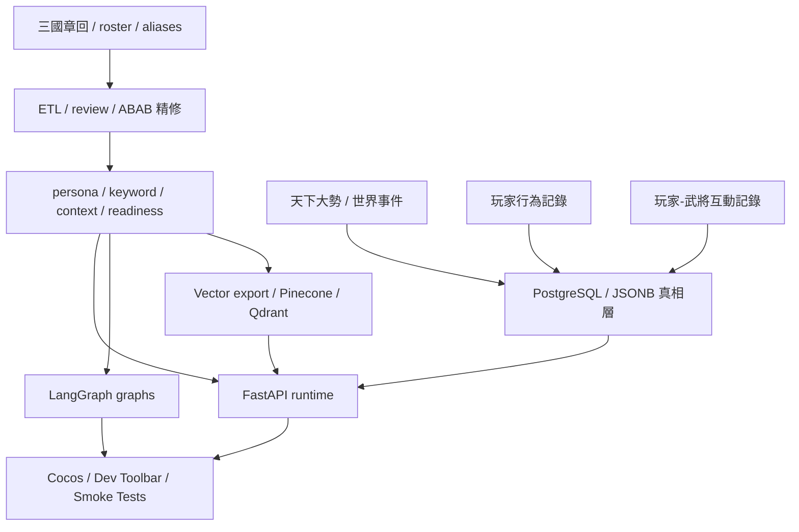
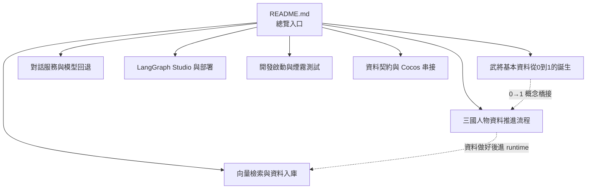
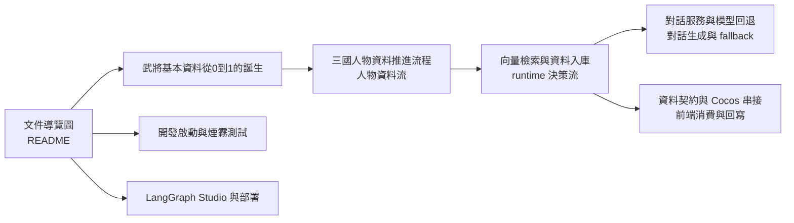

<!-- doc_id: doc_server_service_0001 -->
# NPC Brain Service

`server/npc-brain/` 是 3KLife 三國大腦中台的 **runtime service 層**。  
Pipeline 負責產生 canonical events / keyword fixtures / persona cards；npc-brain 則負責把這些產物轉成 Cocos、LangGraph 與後續行為決策可直接消費的服務介面。

一句話定位：

- **pipeline**：整理人物知識與 runtime-ready 資產
- **npc-brain**：提供對話、選項、決策入口與 debug / smoke / Studio 驗證能力
- **vector / PostgreSQL**：提供召回與真相層，不讓 runtime 直接重掃原文

## 系統總覽



## 核心原則

1. **runtime 不重新掃文本**：原始章回解析與事件整理都在 pipeline 完成。
2. **vector DB 不是 canonical truth**：向量庫只負責召回，真相仍在結構化 artifact / PostgreSQL / JSONB。
3. **人物最終決策至少同時依賴三層資料**：
   - 人物本體資料（persona / keywords / relations / events）
   - 天下大勢 / 世界事件
   - 玩家行為與玩家-武將互動歷史
4. **ABAB…C 是精修 lane，不是大吞吐 lane**：它適合把高價值人物壓到 `ready-for-dialogue-smoke`。

## 目前主要入口

### FastAPI

- `GET /healthz`
- `GET /v1/npc/context-options?generalId=<id>`
- `GET /v1/npc/keyword-options?generalId=<id>`
- `POST /v1/npc/dialogue`

### LangGraph

- `npc_brain_graph`
- `sanguo_etl_graph`
- `sanguo_etl_repair_graph`
- `progress_advancement_graph`

## 30 秒快速啟動

### 啟動 FastAPI

```bash
cd server/npc-brain
$HOME/.venv/3klife-etl/bin/python -m pip install -r requirements.txt
$HOME/.venv/3klife-etl/bin/python -m uvicorn app.main:app --host 127.0.0.1 --port 8765 --reload
```

### 啟動 LangGraph dev server

```bash
cd server/npc-brain
$HOME/.venv/3klife-etl/bin/python -m pip install -U "langgraph-cli[inmem]"
$HOME/.venv/3klife-etl/bin/langgraph dev --no-browser
```

### 先看健康檢查

```bash
curl http://127.0.0.1:8765/healthz
```

## 文件導覽

### 文件導覽圖



先看 `README.md` 了解系統全貌，再依你現在的工作目標分流到對應主題文件。

| 文件 | 內容焦點 |
|---|---|
| [三國人物資料推進流程](./文件/三國人物資料推進流程.md) | 從章回 → review → ABAB 精修 → readiness → runtime 的完整人物資料生產線 |
| [武將基本資料從0到1的誕生](./文件/武將基本資料從0到1的誕生.md) | 解釋一位武將如何從原始文本長成可被對話系統使用的最小知識包 |
| [對話服務與模型回退](./文件/對話服務與模型回退.md) | Dialogue API、模型 preset、fallback chain、history cache |
| [向量檢索與資料入庫](./文件/向量檢索與資料入庫.md) | Pinecone / Qdrant、vector-ready records、雙軌資料庫與讀回驗證 |
| [LangGraph Studio 與部署](./文件/LangGraph%20Studio%20與部署.md) | Graphs、Studio 連線、本地 dev server、localtunnel、Deployments |
| [開發啟動與煙霧測試](./文件/開發啟動與煙霧測試.md) | 本機安裝、healthz、smoke tests、建議檢查順序 |
| [資料契約與 Cocos 串接](./文件/資料契約與%20Cocos%20串接.md) | Data contract、前端呼叫方式、debug panel 與 DTO 欄位 |
| [README 拆分規劃](./說明文件拆分規劃.md) | 這次拆分的原則、命名與維護方式 |

### 文件關聯導航矩陣



這張矩陣可以這樣讀：

- **文件導覽圖**：先決定你要看哪個主題
- **武將基本資料從 0 到 1**：先理解單一武將為什麼能被對話系統使用
- **人物資料流**：再看整條資料生產線怎麼推進
- **runtime 決策流**：最後看這些資料如何進入檢索、決策與對話 runtime

## 建議閱讀順序

### 如果你是第一次進來

1. 先看這份 `README.md`
2. 再看 [武將基本資料從0到1的誕生](./文件/武將基本資料從0到1的誕生.md)
3. 再看 [三國人物資料推進流程](./文件/三國人物資料推進流程.md)
4. 然後依工作目標去看對應文件

### 如果你想先理解一個武將怎麼從 0 到 1

1. [武將基本資料從0到1的誕生](./文件/武將基本資料從0到1的誕生.md)
2. [三國人物資料推進流程](./文件/三國人物資料推進流程.md)
3. [向量檢索與資料入庫](./文件/向量檢索與資料入庫.md)

### 如果你現在要做 runtime 對話

1. [對話服務與模型回退](./文件/對話服務與模型回退.md)
2. [資料契約與 Cocos 串接](./文件/資料契約與%20Cocos%20串接.md)
3. [開發啟動與煙霧測試](./文件/開發啟動與煙霧測試.md)

### 如果你現在要做檢索 / 資料庫

1. [向量檢索與資料入庫](./文件/向量檢索與資料入庫.md)
2. [三國人物資料推進流程](./文件/三國人物資料推進流程.md)

### 如果你現在要做 Studio / 對外測試

1. [LangGraph Studio 與部署](./文件/LangGraph%20Studio%20與部署.md)
2. [開發啟動與煙霧測試](./文件/開發啟動與煙霧測試.md)

## 目前拆分狀態

這份 `README.md` 已改成 npc-brain 的**摘要入口版**。  
原本的大段操作手冊、向量教學、Studio 細節與資料契約，已移到 `server/npc-brain/文件/` 下的主題文件中維護。
