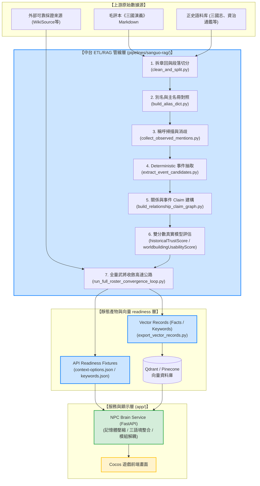
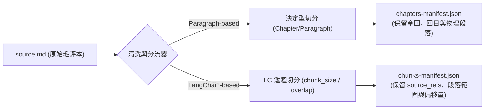
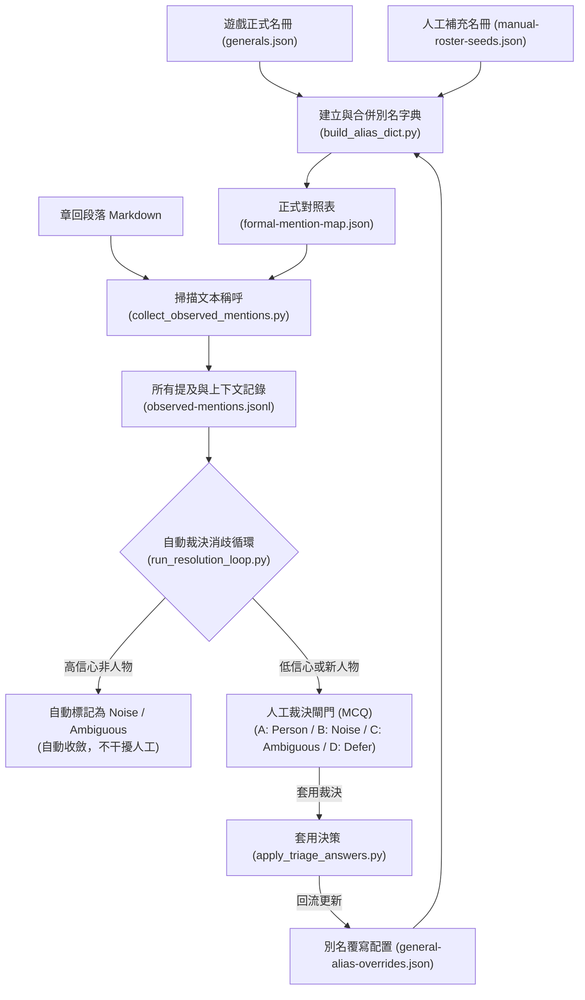
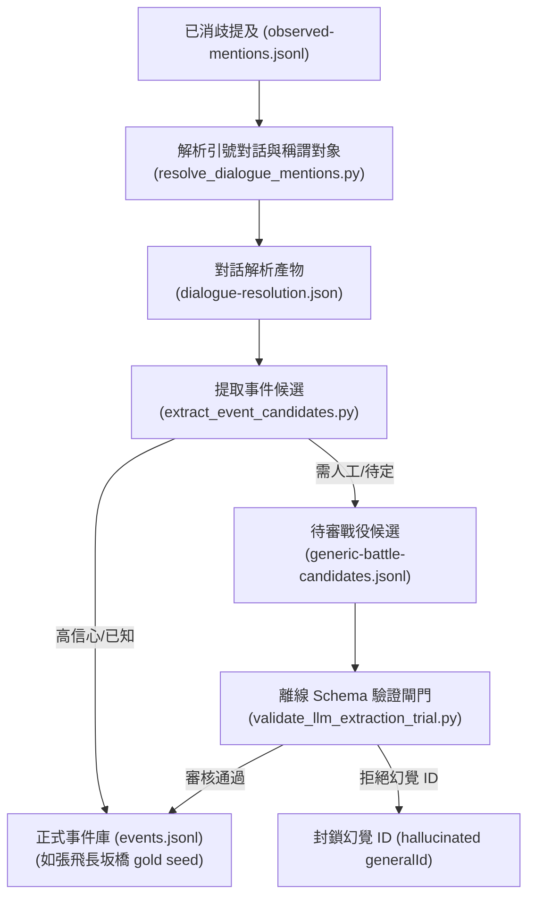
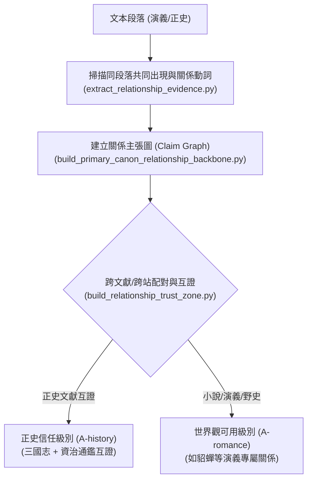
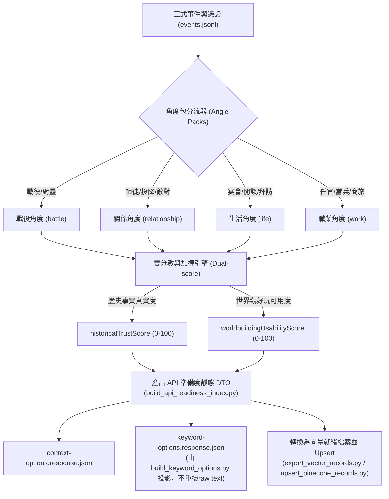
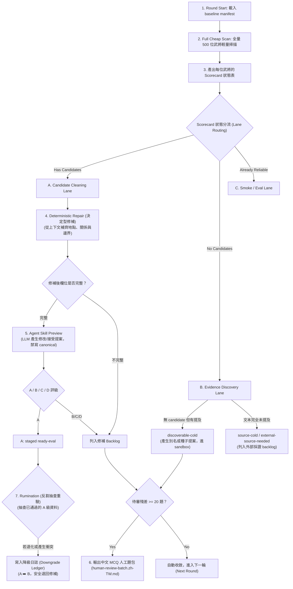

# 三國武將大腦 ETL/RAG 管線：從原始文本到高智能 NPC 的 0 ➡️ 1 深度解析

本文件完整剖析 `3klife-npc-brain` 專案中，**三國人物管線（Character Pipeline）**的整體運作流程。這套管線的核心哲學是 **「決定型優先 (Deterministic-first)」**，即能用嚴格規則與結構化程式碼解決的步驟，絕不盲目交給昂貴且可能產生幻覺的 LLM，並透過「雙分數真實模型 (Dual-score truth model)」與「全量收斂高速公路 (Full Roster Convergence Highway)」實現數據的自動洗淨、增長與重驗。

---

## 🎯 1. 系統整體架構圖 (System Architecture)

三國大腦中台的設計在架構上是徹底解耦的。資料從最上游的原始文本，經過三車道管線的清洗、過濾、評分、互證與反芻，最終產出靜態的 API Fixtures 與向量索引，最後才由最下游的 FastAPI 微服務（NPC Brain Service）載入並提供給 Cocos 遊戲前端使用。

> [!IMPORTANT]
> **排查與責任分工原則 (docs/keep.md 規範)**
> - **上游 pipeline / artifact (B)**：負責產出 canonical 的人物 profiles、邊界事件與正確的 evidence export。**禁止把錯的 linking 或短摘留給下游補救。**
> - **NPC Brain service (A)**：負責通用選卡、資料檢核、Fail-fast 與對話記憶體壓縮。**禁止為單一人物或 demo 寫死規則或台詞。**
> - **前端畫面 (C)**：負責通用顯示、互動、loading 狀態與診斷呈現。**禁止在前端自行判定性格正確性或補寫小劇場。**
> - **排查順序固定為**：先查 **(B) 上游資料** ➡️ 再查 **(A) service 邏輯** ➡️ 最後才查 **(C) 前端畫面**。禁止顛倒順序以避免用下游硬補掩蓋上游髒資料。

---

## 📖 2. 數據 0 ➡️ 1 拆解書中章節 (Clean & Split)

管線的第一步是將長篇的原始 Markdown 文本轉換為結構化、可被機器穩定檢索與抽取的顆粒化段落。

### 兩套切分策略並行
1. **決定型章回拆解 (Deterministic-first)**：
   - 腳本：`clean_and_split.py`。
   - 運作：讀取原始 `source.md`，清洗不必要的標點與空白，精準識別每一回的「章回邊界」與「物理段落」。
   - 產出：`chapters-manifest.json` 以及 `markdown/` 下的各個章回檔案。這提供了**可物理追溯的 locator (例如：第十回 / p12 / 段2)**。
2. **語意塊切分 (Hybrid LangChain Character Splitter)**：
   - 使用參數 `--chunk-with-langchain --chunk-size 500 --chunk-overlap 80`。
   - 運作：針對 LLM 上下文視窗（Context Window）做前置優化，將長度不一的段落切成固定大小且帶有重疊區間的 Chunks。
   - 產出：`chunks-manifest.json` 與段落級的 `chunks/<chapter_id>/<chunk_id>.md`。這些 Chunks 會保留 `source_refs` 與偏移量，用以做後續的 RAG 向量檢索與 LLM 語意審查。

---

## 🏷️ 3. 別名字典建置與消歧 (Alias Dict & Resolution Loop)

在三國文本中，同一個人有極多種稱呼（如：許褚又稱「許仲康」、「虎痴」、「許將軍」）。如何精準將文本中的各種稱呼對照到唯一的遊戲武將 ID（`generalId`）是管線的關鍵考驗。

### 別名消歧與收斂機制
1. **主字典建置**：`build_alias_dict.py` 整合正式名冊、人工補充種子（`manual-roster-seeds.json`）與覆寫規則，產出 canonical 的 `formal-mention-map.json`。
2. **文本提及掃描**：`collect_observed_mentions.py` 在段落中掃描符合的人名或未知詞，為每筆 mention 紀錄同段落的 `sceneParticipants`，作為對話消歧的上下文依據。
3. **別名安全閘門 (Alias Hit Gate)**：`check_event_alias_hits.py` 在事件抽取前執行。預先檢查新人工 alias（如「曹瞞 ➡️ cao-cao」、「孫郎 ➡️ sun-ce」）是否能精準命中 observed mentions。**如果此處發生 Fail，管線會立即熔斷 (Fail-fast)**，要求修正 alias 配置，防止髒身份混入事件抽取層。
4. **Resolution 自動與人工雙軌收斂**：
   - 運作：`run_resolution_loop.py` 重建別名字典，並根據 `config/unresolved-triage-decisions.json` 進行稱呼分流。
   - **自動收斂**：若未知詞高機率為噪音（如「馬步兵」這類官職複合詞），開啟 `--auto-fill-suggestions` 會將其自動標記為 `B noise` 或 `C ambiguous`，不打擾人類。
   - **人工裁決 (MCQ Gate)**：當未裁決項目累積時，輸出可讀的 MCQ 人工題，選項包含：`A person` / `B noise` / `C ambiguous` / `D defer`。裁決後透過 `apply_triage_answers.py` 回灌至 `general-alias-overrides.json`，在下一輪重算時成為 deterministic 規則的燃料，**實現越跑越快的正循環**。

---

## ⚔️ 4. 人物內容與事件過濾管線 (Events & Dialogue Filtering)

當人物身份確立後，管線將進一步提取該武將在文本中參與的「事件（Events）」與「對話（Dialogues）」，拒絕直接讓 LLM 憑空猜測。

### 事件與對話過濾步驟
1. **對話消歧與稱謂解析 (E-5a)**：
   - 腳本：`resolve_dialogue_mentions.py`。
   - 運作：解析文本中引號內對話、address-title（如「將軍」、「主公」等稱謂指向），結合 `sceneParticipants`，確定「誰在對誰說話」，輸出結構化的對話憑證。
2. **Deterministic 事件候選抽取 (E-5b)**：
   - 腳本：`extract_event_candidates.py`。
   - 運作：基於 observed mentions 與 scene context，利用 deterministic baseline 建立事件候選，產出 ready events 與待審查的 `generic-battle-candidates.jsonl`（戰役候選）。
3. **離線 Schema 驗證閘門 (Schema Gate)**：
   - 腳本：`validate_llm_extraction_trial.py`。
   - 運作：進行嚴格的離線驗證，封鎖任何由 LLM 幻覺生成的武將 ID 或無效時間地點。只有通過驗證且經由人工或高信心條件通過的候選，才能升級為正式的 `events.jsonl`。

---

## 🤝 5. 關係掃描與互證信任區 (Relationship & Claim Graph)

此步驟旨在建立武將與武將、武將與事件之間的關聯圖（Claim Graph），並透過「跨站/跨文獻互證」建立資訊的信任分級。

### 關係與主張圖的核心機制
- **主張圖建構 (Claim Graph)**：
  - 管線掃描人物在同一個段落、同一個事件中的共同出現率（Co-occurrence），結合對話指向與特徵動詞（如「投奔」、「大怒欲斬」、「結為義兄弟」），由 `extract_relationship_evidence.py` 與 `build_primary_canon_relationship_backbone.py` 描繪出多維度的關係網主張。
- **信任區判定 (Trust Zone)**：
  - 核心腳本：`build_relationship_trust_zone.py`。
  - **獨立來源原則**：同一部《三國志》跨站點重複抓取不算獨立史料（扣 duplicateFamilyPenalty）；只有像《三國志》與《後漢書》或《資治通鑑》等不同來源家族互證，才算真正交叉支持。
  - **分層歸宿**：
    - **`A-history`**：歷史層級 A。必須有兩個以上獨立 `sourceFamily` 互證，且不存在 hard conflict。
    - **`A-romance`**：世界觀/小說層級 A。例如演義專屬人物（貂蟬、關銀屏）的關係線，可在此層級被積極補全，但不宣稱為正史。

---

## 💎 6. 精鍊資料篩選與雙分數模型 (Multi-angle & Dual-score)

為了解決不同應用情境對資料的要求，管線支援「多維度角度包 (Angle Packs)」與「雙分數真實模型 (Dual-score truth model)」，並產出最終的 API 準備度靜態 DTO。

### 雙分數模型 (Dual-score Truth Model) 詳解

#### 1. 歷史可信度分數 (`historicalTrustScore`)
評估該 claim 若作為「史實」，其可信程度：

$$\text{historicalTrustScore} = \text{sourceStrengthScore} \times 0.30 + \text{crossEvidenceScore} \times 0.25 + \text{quoteLocatorScore} \times 0.15 + \text{claimSpecificityScore} \times 0.10 + \text{extractorAgreementScore} \times 0.10 + \text{reviewerAgreementScore} \times 0.10 - \text{conflictPenalty} - \text{duplicateFamilyPenalty}$$

*   **`sourceStrengthScore` (30%)**：文獻原典強度。正史原文給 95-100；稗官野史給 55；部落格給 15。
*   **`crossEvidenceScore` (25%)**：交叉支持度。雙獨立史料家族互證給 100；無交叉支持給 0。
*   **`quoteLocatorScore` (15%)**：可追溯性。同時具備 `quote + locator + hash` 給 100。
*   **`conflictPenalty` (扣分項)**：每項硬衝突扣 15-35 分。
*   **`duplicateFamilyPenalty` (扣分項)**：同一部書跨站重複視為重複抄錄，扣 5-15 分。

#### 2. 世界觀可用度分數 (`worldbuildingUsabilityScore`)
評估該 claim 是否值得納入遊戲對話、關係網、活動與女性角色資料池：

$$\text{worldbuildingUsabilityScore} = \text{historicalTrustScore} \times 0.45 + \text{romanceFolkloreSupportScore} \times 0.20 + \text{profileCompletenessScore} \times 0.15 + \text{relationshipPlayableScore} \times 0.10 + \text{activityDialogueSeedScore} \times 0.10 + \text{femalePriorityBoost} - \text{contradictionPenalty}$$

*   **女性優先加權策略 (`femalePriorityBoost`)**：
    三國歷史文獻中女性史料極為稀少。為了豐富遊戲性，管線**務實地在世界觀可用度上提供加權，但在歷史可信度上嚴格守門**：
    *   `+8`：女性基礎補全。
    *   `+12`：女性且正史極稀少。
    *   `+15`：女性且已有演義、傳說或強大互動關係支撐（如貂蟬、關銀屏、馬雲騄）。
    *   *註：加權後的分數上限為 95 分，避免自動灌爆。*

---

## 🚀 7. 全量武將收斂高速公路 (Full Roster Highway v2/v3)

為了避免管線只精修明星武將，而將幾百位普通武將遺漏，專案設計了「全量武將收斂高速公路 (v2/v3)」，讓所有武將每輪都能低成本進場重算，並停在人工/AI 混合的安全閘門前。

### 高速公路核心特點

1.  **廉價全量過篩 (Cheap Scan)**：
    先跑便宜的 mentions 與 events 掃描，產出 `Person Scorecard` 狀態。確定有機會升級的人，才送至較貴的 agent preview，大幅降低 LLM 運算開銷。
2.  **無 Candidate 武將的拯救 (Evidence Discovery Lane)**：
    沒有 candidate 的武將不會被直接略過。系統會調查他是否在 Roster 內，再查 mentions 找是否有本名、字、官職命中。
    *   **有 mention 但無 candidate** ➡️ 標記為 `discoverable-cold`，在 Sandbox 跑別名規則提案。
    *   **無 mention** ➡️ 標記為 `source-cold` / `external-source-needed`，列入外部文獻抓取 Backlog。
3.  **雙重驗證與人工閘門 (Human Gate)**：
    *   **第一層 (Deterministic Repair)**：自動從上下文關係補齊地點與邊界。
    *   **第二層 (Agent Skill Preview)**：Agent 只能產生 edits proposal，**預設 `canonicalWrites=false`**，嚴禁直接寫入正式資料庫。
    *   **第三層 (Human Gate)**：待審題數累積未滿 20 題時，系統繼續跑下一輪；滿 20 題時才打擾人類，輸出圖文並茂、附帶原文上下文與推薦理由的中文 MCQ。
4.  **反芻重驗與降級機制 (Rumination & Downgrade Ledger)**：
    已經通過的 `A` 級資料並非永久神聖不可侵犯。每輪 `ruminationAuditRecord` 會隨機抽查高影響力、單一來源、或曾有過低分歷史的 `A` 級 claim，重新進行交叉核對。若發現新證據產生硬衝突，或來源網站被降權，會立即寫入 `downgrade-ledger.json`，將其**降級退回修補 Backlog**，確保大腦知識庫隨著時間只會「越洗越乾淨」，拒絕髒資料沈澱。

---

## 📈 8. 管線核心腳本與執行命令速查

| 階段與任務 | 核心 Python 腳本 | 典型執行命令 (過程中不修改代碼、不提交) |
| :--- | :--- | :--- |
| **0. 清洗與拆章回** | `clean_and_split.py` | `python clean_and_split.py --input source.md --output-root markdown/ --chunk-with-langchain --overwrite` |
| **1. 建立別名對照** | `build_alias_dict.py` | `python build_alias_dict.py --overwrite` |
| **2. 別名召回檢查** | `check_event_alias_hits.py` | `python check_event_alias_hits.py --overwrite` |
| **3. 對話稱謂消歧** | `resolve_dialogue_mentions.py` | `python resolve_dialogue_mentions.py --overwrite` |
| **4. 決定型事件抽取** | `extract_event_candidates.py` | `python extract_event_candidates.py --overwrite` |
| **5. 投影 UI 關鍵字** | `build_keyword_options.py` | `python build_keyword_options.py --general-id zhang-fei --overwrite` |
| **6. 評估與大腦準備度** | `build_api_readiness_index.py` | `python build_api_readiness_index.py --general-id zhang-fei --overwrite` |
| **7. 向量就緒導出** | `export_vector_records.py` | `python export_vector_records.py --output-root vector-ready/ --overwrite` |
| **8. 向量資料庫上傳** | `upsert_pinecone_records.py` | `python upsert_pinecone_records.py --records-root vector-ready/ --embedding-provider mock --dry-run` |
| **9. 全量高速公路循環** | `run_full_roster_convergence_loop.py` | `python run_full_roster_convergence_loop.py --run-id full-roster-r1 --top 500 --batch-size 100 --overwrite` |

---

> [!TIP]
> **共識提醒 (docs/keep.md)**
> 本管線是一套資料驅動、高度解耦、擁有自我檢算與反芻降級能力的完整閉環系統。
> 若您在未來的管線擴充中達成了新的技術決策，請務必提醒用戶更新 `docs/keep.md` 以確保 AI 協作的最高共識一致性。
