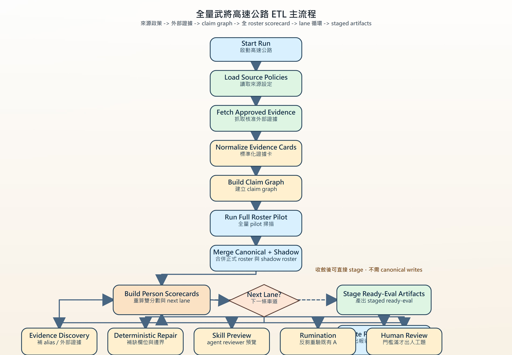
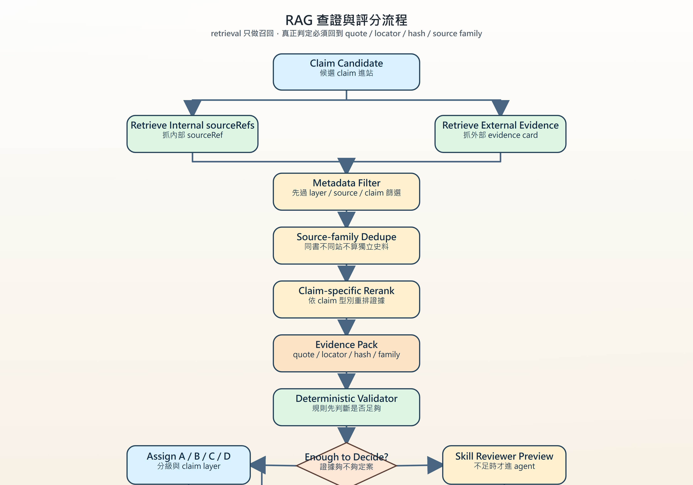
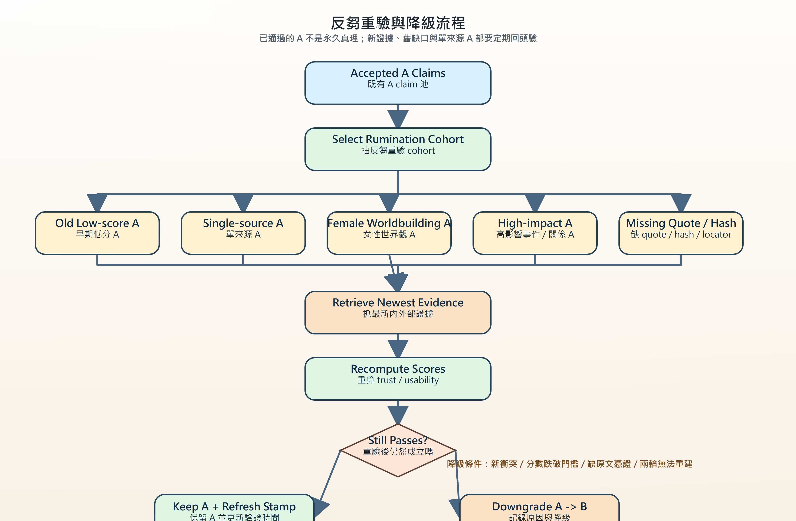

<!-- doc_id: doc_server_pipeline_0005 -->
# 全量武將 ETL/RAG 高速公路信任評分與反芻規格 v2

這份文件定義一條新的全量武將高速公路 v2，專門處理「全 roster 重算、外部證據整合、雙分數評估、女性資料補全、反芻重驗與可追蹤報表」。它不取代原本的 ABAB 與 three-lane 流程，而是把既有腳本視為既有子程序，在更高一層補上信任評分與收斂規則。

核心原則只有兩句：

1. `historicalTrustScore` 要誠實，不能把小說、稗官、遊戲 wiki 假裝成正史。
2. `worldbuildingUsabilityScore` 要務實，因為我們的最終目標是做出一個好玩、可用、可擴張的三國世界觀資料庫。

## 流程圖

下面三張 JPG 會由 `tools_node/render-sanguo-rag-highway-diagrams.js` 自動產生，供文件、簡報與人工審核直接使用。







## 定位與邊界

### 這份規格要解決什麼

- 全量武將與 shadow roster 要能每輪重算，不只精修少數明星武將。
- 外部證據要能動態加入，但不可以單一網站直接把資料洗成正史 A。
- 女性角色因為史料稀少，要能被更積極補全，但不能因此污染歷史可信度。
- 已通過的 A 不應永遠神聖不可動，要能被新證據與反芻重驗降級。

### 這份規格不做什麼

- 不直接改寫 `generals.json`。
- 不讓高速公路自動做 canonical promotion。
- 不把向量召回分數當作真相分數。
- 不把 `A-romance` 說成 `A-history`。

## 設計原則

### Deterministic-first

先讓規則、sourceRef、quote、locator、hash、schema 做完該做的事，再把剩下真的無法自動裁決的殘差交給 skill preview 或人工。

### Dual-score truth model

每筆 claim、每位人物都保留兩條分數線：

- `historicalTrustScore`：這件事像不像可信史料事實。
- `worldbuildingUsabilityScore`：這件事值不值得納入遊戲世界可用知識。

### Layer-aware promotion

任何升級都要分清楚是哪一層：

- `history`
- `romance`
- `folklore`
- `worldbuilding`

### Replayable decisions

所有升降級都要能回放與重算，不能靠「上次好像看過」這種人工記憶。

### canonicalWrites=false by default

高速公路只生產 staging、ready-eval、shadow roster、scorecard、report，不直接寫正式 canonical 資料。

## 名詞定義

- `Evidence Card`：單一來源片段的標準化證據卡。
- `Claim`：對某個人物、關係、事件、地點、職銜或性格的可驗證陳述。
- `Claim Graph`：claim 與 evidence、人物、事件之間的關聯圖。
- `Person Scorecard`：每位人物的雙分數、完整度、下一步 lane 與狀態。
- `A-history`：歷史層級可信 A。
- `A-romance`：小說或世界觀層級可信 A，不宣稱為史實。
- `Shadow Roster`：從外部證據或 observed mentions 浮出的候選人物池，不直接污染正式 roster。
- `Rumination`：對既有 A 做抽查、重驗、降級的反芻流程。
- `Residual Dossier`：本輪仍未收斂的殘差問題集合。
- `Downgrade Ledger`：A 降成 B 的記錄簿，保留原因與證據。

## 來源政策與證據分層

### Source Layer

- `history`：正史、史籍、可回溯史料轉錄。
- `romance`：小說、演義、戲曲改寫。
- `folklore`：民間傳說、野史、地方逸聞。
- `encyclopedia`：百科與二手整理。
- `game`：遊戲 wiki、設定集、玩家整理。
- `manual`：人工補充或人工摘錄。

### Trust Tier

- `primary-text`：原典或可信原文轉錄。
- `primary-text-transcription`：原典轉錄站，但仍需校對來源家族。
- `scan-verified`：掃描本或可回頁碼 OCR。
- `secondary`：二手整理，有用但不可單獨升歷史 A。
- `folklore`：野史、傳說、演義脈絡。
- `blocked`：禁止作為自動升級依據。

### 獨立來源判定

- 同一本《三國志》出現在兩個網站，算同一 `sourceFamily`，不能當兩份獨立史料。
- 《三國志》與《資治通鑑》可視為獨立來源家族。
- 《三國演義》只能幫助 `romance/worldbuilding` 升級，不能直接把 `history` 升 A。
- 百科、部落格、遊戲 wiki 預設只能進 `suggested` 或 `blocked`，不能單獨參與自動升 `A-history`。

## 資料結構

### 1. sourcePolicy

```json
{
  "id": "wikisource-sanguozhi",
  "status": "approved|suggested|blocked",
  "adapterType": "ctext|wikisource|gutenberg_text|scan_pdf|manual_quote|static_html",
  "sourceFamily": "sanguozhi",
  "sourceLayer": "history",
  "trustTier": "primary-text-transcription",
  "baseUrl": "https://zh.wikisource.org/wiki/三國志",
  "singleSourceMaxGrade": "B",
  "claimScopes": ["identity", "relationship", "event", "location", "title"],
  "notes": "同一部書跨站不算獨立史料"
}
```

### 2. evidenceCard

```json
{
  "evidenceId": "external:wikisource-sanguozhi:wei-06:hash",
  "sourcePolicyId": "wikisource-sanguozhi",
  "sourceFamily": "sanguozhi",
  "sourceLayer": "history|romance|folklore|encyclopedia|game|manual",
  "trustTier": "primary-text|transcription|secondary|folklore|blocked",
  "url": "https://example",
  "locator": "卷六 / p13 / 段2",
  "quote": "短原文片段",
  "normalizedText": "正規化後片段",
  "textHash": "sha256:...",
  "claimHints": ["relationship", "event", "location"],
  "generalIds": ["dong-zhuo", "lv-bu"],
  "canonicalWrites": false
}
```

### 3. claim

```json
{
  "claimId": "claim:person:diaochan:identity:hash",
  "claimType": "identity|relationship|event|location|title|trait|activity",
  "claimLayer": "history|romance|worldbuilding",
  "claimText": "貂蟬與王允、董卓、呂布事件相關",
  "generalIds": ["diaochan", "wang-yun", "dong-zhuo", "lv-bu"],
  "sourceEvidenceIds": ["external:..."],
  "sourceRefSupport": ["010#p12"],
  "reviewGrade": "A|B|C|D",
  "historicalTrustScore": 71,
  "worldbuildingUsabilityScore": 89,
  "confidenceBreakdown": {
    "sourceStrengthScore": 80,
    "crossEvidenceScore": 45,
    "quoteLocatorScore": 95,
    "claimSpecificityScore": 80,
    "extractorAgreementScore": 70,
    "reviewerAgreementScore": 65,
    "conflictPenalty": 0,
    "duplicateFamilyPenalty": 10,
    "staleEvidencePenalty": 0,
    "femalePriorityBoost": 15
  },
  "promotionState": "staged|blocked|ready-eval",
  "canonicalWrites": false
}
```

### 4. personScorecard

```json
{
  "generalId": "diaochan",
  "displayName": "貂蟬",
  "gender": "female",
  "rosterState": "canonical|manual-seed|shadow",
  "historicalTrustScore": 64,
  "worldbuildingUsabilityScore": 91,
  "completenessScore": 76,
  "priorityScore": 88,
  "femalePriorityMode": "female-sparse-romance-boost",
  "readyEventCount": 4,
  "claimCount": 18,
  "missingFields": ["birthYear", "deathYear"],
  "nextLane": "evidence-discovery|deterministic-repair|skill-preview|rumination|human-review",
  "promotionState": "staged|blocked|ready-eval",
  "canonicalWrites": false
}
```

### 5. ruminationAuditRecord

```json
{
  "auditId": "rumination:r004:diaochan:claim-123",
  "roundId": "r004",
  "claimId": "claim:person:diaochan:identity:hash",
  "cohortReason": "single-source-a|old-low-score-a|female-worldbuilding-a|high-impact-a|missing-proof-a",
  "previousGrade": "A",
  "previousHistoricalTrustScore": 81,
  "newHistoricalTrustScore": 72,
  "result": "keep-a|downgrade-to-b",
  "downgradeReason": "single source lost weight after cross-check",
  "canonicalWrites": false
}
```

### 6. ruleProposal

```json
{
  "proposalId": "rule:r005:alias:diaochan-chanfei",
  "proposalType": "alias|location|relationship|event-boundary|noise-filter",
  "summary": "新增貂蟬別名與 romance 層 cue",
  "sourceExamples": ["012#p08", "019#p03"],
  "expectedImpact": {
    "candidateReduction": 12,
    "skillPreviewReduction": 4,
    "humanReviewReduction": 2
  },
  "sandboxStatus": "pending|pass|fail",
  "canonicalWrites": false
}
```

## 分數系統

### historicalTrustScore

`historicalTrustScore` 的目的是回答：這個 claim 若被當成史實，可信到什麼程度。

所有 component 先算成 `0~100`，最後再依權重線性組合：

```text
historicalTrustScore =
  sourceStrengthScore * 0.30
+ crossEvidenceScore * 0.25
+ quoteLocatorScore * 0.15
+ claimSpecificityScore * 0.10
+ extractorAgreementScore * 0.10
+ reviewerAgreementScore * 0.10
- conflictPenalty
- duplicateFamilyPenalty
- staleEvidencePenalty
```

#### component 定義

- `sourceStrengthScore`
  - 95~100：正史原文或可信轉錄，且來源清楚。
  - 75~90：二手但嚴謹整理，有可追溯引用。
  - 40~70：百科、整理文、一般二手資料。
  - 0~35：野史、未署名整理、低可信網站。

- `crossEvidenceScore`
  - 100：兩個以上獨立 `sourceFamily` 支持同一 claim。
  - 70：內部 `sourceRef` 與一個外部 B 證據互證。
  - 40：只有單一強來源。
  - 0：沒有交叉支持。

- `quoteLocatorScore`
  - 100：同時有 `quote + locator + textHash`。
  - 70：有 `quote + locator`。
  - 40：只有 locator 或只有 quote。
  - 0：沒有原文憑證。

- `claimSpecificityScore`
  - 90：具體到人物、事件、地點、關係方向。
  - 60：人物與事件有，但邊界仍模糊。
  - 30：只知道提到這個人，無法形成穩定 claim。

- `extractorAgreementScore`
  - 100：多輪 deterministic 輸出一致。
  - 60：多輪有少量欄位差異。
  - 20：每輪抽取結構都飄動。

- `reviewerAgreementScore`
  - 100：deterministic、skill preview、人工都一致。
  - 70：deterministic 與 reviewer 一致，但人工未介入。
  - 40：reviewer 之間分歧仍大。

#### penalty 定義

- `conflictPenalty`
  - 每個 hard conflict 扣 15~35。
- `duplicateFamilyPenalty`
  - 同書跨站重複只加 transcription confidence，不算獨立證據，通常扣 5~15。
- `staleEvidencePenalty`
  - 舊 A 缺 quote/hash/locator，或長期未重驗，扣 5~20。

### worldbuildingUsabilityScore

`worldbuildingUsabilityScore` 的目的是回答：這個 claim 值不值得進遊戲世界觀、對話、關係網、活動種子與女性角色內容池。

```text
worldbuildingUsabilityScore =
  historicalTrustScore * 0.45
+ romanceFolkloreSupportScore * 0.20
+ profileCompletenessScore * 0.15
+ relationshipPlayableScore * 0.10
+ activityDialogueSeedScore * 0.10
+ femalePriorityBoost
- contradictionPenalty
```

#### component 定義

- `romanceFolkloreSupportScore`
  - 90：演義、野史、民間資料對同一角色很完整。
  - 60：有零散支撐，可形成 worldbuilding 素材。
  - 20：只有單一弱旁證。

- `profileCompletenessScore`
  - 依人物是否已有身份、派系、關係、活動、對話鉤子等估算。

- `relationshipPlayableScore`
  - 角色是否帶出可玩的關係線、互動線、事件線。

- `activityDialogueSeedScore`
  - 是否能投影到生活活動、休閒活動、任務種子、對話素材。

- `femalePriorityBoost`
  - 僅加在 `worldbuildingUsabilityScore`。
  - `+8`：女性基礎補全。
  - `+12`：女性且正史稀少。
  - `+15`：女性且已有 romance / folklore / playable relationship 支撐。
  - 分數上限 `<= 95`，避免自動灌到滿分。

- `contradictionPenalty`
  - 若人物設定互相打架，例如父女關係、派系、時代明顯矛盾，扣 10~30。

### completenessScore

`completenessScore` 用來反映人物資料的完整度，而不是可信度。

```text
completenessScore =
  identityCoverage * 0.20
+ relationshipCoverage * 0.20
+ eventCoverage * 0.20
+ locationCoverage * 0.10
+ titleCoverage * 0.10
+ traitActivityCoverage * 0.10
+ dialogueHookCoverage * 0.10
```

### priorityScore

`priorityScore` 用來決定哪位人物先進 lane，不等於可信度。

```text
priorityScore =
  genericCandidateCount * 5
+ evidenceRefCount * 4
+ mentionCount * 2
+ coreGeneralBoost
+ femalePriorityBoost
+ shadowRosterDiscoveryBoost
- humanPendingPenalty
- repeatedResidualPenalty
```

## 等級與升降級規則

### A-history

- `historicalTrustScore >= 80`
- 且至少兩個獨立 `sourceFamily`
- 或 `internal sourceRef + external B` 支持同一 claim
- 不存在 hard conflict

### A-romance

- `worldbuildingUsabilityScore >= 80`
- 來源層級明確標記為 `romance|folklore|worldbuilding`
- 不得對外宣稱為正史
- 女性角色可在此層級被積極補全

### B

- 分數在 `50~79`
- 或只有單一強來源
- 或欄位已接近完成，但仍缺交叉支持
- 進 `repair / evidence graph / next round`

### C

- 存在明顯衝突、錯配、地點/事件邊界不穩
- 進 `residual dossier`

### D

- 資料不足，暫不裁決
- 等待新 evidence 或新 rule

### A -> B 降級條件

- `historicalTrustScore < 75`
- 新來源產生 hard conflict
- 原 A 缺 `quote / locator / textHash`
- 原 A 只有單一來源，且該 `sourceFamily` 被降權
- rumination 抽查連續兩輪無法重建原結論

## ETL 主流程

### Stage 1. Load source policies

輸入：

- `config/external-evidence-sources.json`
- allowlist / suggested / blocked source policy

輸出：

- 本輪可抓取來源清單
- blocked source ledger

### Stage 2. Fetch approved external evidence

輸入：

- approved source policy

輸出：

- 原始文本或片段
- source fetch log

### Stage 3. Normalize evidence cards

輸入：

- 原始來源片段
- parser / adaptor

輸出：

- `evidenceCard[]`
- `textHash`
- `locator`
- `claimHints`

### Stage 4. Build claim graph

輸入：

- 內部 `sourceRef`
- 外部 `evidenceCard`
- observed mentions

輸出：

- `claim[]`
- `claim -> evidence` 關聯
- `claim -> general/event/location` 關聯

### Stage 5. Full roster pilot

輸入：

- canonical roster
- manual seeds
- shadow roster
- claim graph

輸出：

- `personScorecard[]`
- `discoverable-cold`
- `source-cold`
- `external-source-needed`

### Stage 6. Lane routing

依 `priorityScore + completenessScore + grade status` 分配到：

- `evidence-discovery`
- `deterministic-repair`
- `skill-preview`
- `rumination`
- `human-review`

### Stage 7. Stage artifacts

輸出：

- `staged-ready-eval-events.jsonl`
- `staged-relationship-evidence.jsonl`
- `baseline-manifest.output.json`

### Stage 8. Report

輸出：

- `external-evidence-summary.zh-TW.md`
- `full-roster-scoreboard.zh-TW.md`
- `rule-proposals.zh-TW.md`
- `downgrade-ledger.zh-TW.md`
- `human-review-batch.zh-TW.md`，僅在門檻滿時輸出

## RAG 架構規則

### 檢索規則

- 先抓內部 `sourceRef`，再抓外部 `evidenceCard`
- vector score 只做召回候選，不可直接用來做 grade
- 每次 claim 驗證都要帶 `sourceFamily`、`quote`、`locator`、`textHash`

### 過濾規則

- metadata filter 先依 `claimType`、`claimLayer`、`sourceLayer`、`blocked status` 過濾
- 同 `sourceFamily` 重複不算交叉支持
- 沒有 locator 或原文引句的資料不得升 `A-history`

### reviewer 規則

- skill reviewer 是 reviewer，不是 author
- reviewer 沒有 citation，不准產 A
- reviewer 只能建議 `summary/location/relationshipEdges/claim layer`
- 真正的升級仍要回到 deterministic gate

### 輸出規則

- 每個 claim 的最終輸出都要包含：
  - `reviewGrade`
  - `historicalTrustScore`
  - `worldbuildingUsabilityScore`
  - `sourceEvidenceIds`
  - `claimLayer`
  - `canonicalWrites=false`

## 女性角色加權策略

### 核心立場

女性資料的稀少，不應被誤當成女性角色不值得進世界觀。  
所以女性角色的策略不是灌水 `historicalTrustScore`，而是提高以下三件事：

- 補全優先序
- 非正史層級可用度
- romance / folklore / interpersonal 素材收集力度

### 女性加權模式

- `female-base-boost`
  - 一般女性角色，`femalePriorityBoost = +8`
- `female-sparse-boost`
  - 正史極少，但演義或逸聞有痕跡，`+12`
- `female-sparse-romance-boost`
  - 史料少、世界觀價值高、互動鉤子強，`+15`

### 女性角色升級原則

- 可升 `A-romance`
- 可成為 `worldbuilding-ready`
- 可優先進 `life / relationship / activity` 角度補全
- 不得因為女性加權而越過 `A-history` 的史料門檻

### 女性角色資料缺口策略

- 若史料少但有小說或野史支持，優先收成 `B` 或 `A-romance`
- 若只有遊戲 wiki 或百科，先收進 `suggested/blocked`，等待更強來源
- 若形成可用的互動線、生活活動、情感故事，可先升 `worldbuildingUsabilityScore`

## 反芻重驗規格

### cohort 選取原則

每輪至少抽以下幾類：

- `old-low-score-a`
- `single-source-a`
- `female-worldbuilding-a`
- `high-impact-a`
- `missing-proof-a`

### 重驗流程

1. 重新抓最新內部與外部 evidence
2. 重建 evidence pack
3. 重算雙分數
4. 檢查 hard conflict
5. 若不再達標，寫入 downgrade ledger

### downgrade ledger 必含欄位

- `claimId`
- `generalId`
- `previousGrade`
- `newGrade`
- `previousHistoricalTrustScore`
- `newHistoricalTrustScore`
- `downgradeReason`
- `sourceEvidenceIds`
- `roundId`
- `canonicalWrites=false`

## 人工介入策略

### 何時才出人工題

- `humanPendingCount >= 20`
- 或同一 residual 連續兩輪未解
- 或女性高價值角色在 `A-romance` 與 `B` 之間卡住

### 人工題格式

每題都要直接顯示：

- 題目在問什麼
- 原文線索
- 中文摘要
- `A/B/C/D` 中文說明
- 來源編號
- 缺欄位
- 推薦判定

### 人工答案如何回流

- 先進 decision ledger
- 再轉成 rule proposal 或 score override sidecar
- 下一輪 deterministic extractor 與 scorecard 全量重跑

## 產物與目錄規約

```text
server/npc-brain/pipelines/sanguo-rag/
  full-roster-confidence-rag-highway.zh-TW.md
  diagram-assets/
    full-roster-confidence-etl-flow.jpg
    full-roster-confidence-rag-flow.jpg
    full-roster-confidence-rumination-flow.jpg

local/codex-smoke/knowledge-growth/<run-id>/
  baseline-manifest.input.json
  external-evidence/
  claim-graph/
  roster-scorecards/
  evidence-discovery/
  deterministic-repair/
  skill-preview/
  rumination/
  human-gate/
  staged/
  reports/
  baseline-manifest.output.json
```

## 里程碑

| 里程碑 | 目標 | 主要交付物 | 驗收重點 |
|--------|------|------------|----------|
| `M0` | 文件與流程圖落地 | 本文件 + 3 張 JPG | 規格可讀、圖檔可直接引用 |
| `M1` | 外部來源政策 | `external-evidence-sources.json` | allowlist / blocked / singleSourceMaxGrade 可重算 |
| `M2` | evidence adaptor 層 | `ctext / wikisource / manual_quote` adaptor | evidenceCard 可穩定輸出 |
| `M3` | claim graph + score engine | claim / scorecard / scoring report | `historicalTrustScore` 與 `worldbuildingUsabilityScore` 可重算 |
| `M4` | full roster convergence loop | `run_full_roster_convergence_loop.py` | 全量 pilot + lane routing 正常 |
| `M5` | 女性角色補全策略 | female priority config + reports | 女性只加 worldbuilding，不加歷史可信 |
| `M6` | rumination lane | downgrade ledger + audit report | A 可被抽查與降級 |
| `M7` | 人工閘門與規則回流 | human review batch + rule proposals | 滿 20 題才出人工，規則可回灌 |
| `M8` | acceptance / regression | smoke scripts + report pack | `canonicalWrites=false` 一致維持 |

## Checklist

### M0 文件與圖檔

- [ ] 新文件完成並納入 doc_id registry
- [ ] 三個 mermaid 流程各自有對應 JPG
- [ ] README 與高速公路舊文件補上 v2 連結

### M1 來源政策

- [ ] allowlist / suggested / blocked 結構定案
- [ ] 同一 `sourceFamily` 跨站不算獨立史料
- [ ] `singleSourceMaxGrade` 與 `claimScopes` 生效

### M2 證據卡

- [ ] evidenceCard 含 `quote / locator / textHash`
- [ ] adapter 層可輸出 `sourceLayer / trustTier`
- [ ] 所有輸出標 `canonicalWrites=false`

### M3 Claim 與評分

- [ ] claim graph 可連到人物 / 事件 / 地點
- [ ] `historicalTrustScore` 可重算
- [ ] `worldbuildingUsabilityScore` 可重算
- [ ] `completenessScore` 與 `priorityScore` 可重算

### M4 Full roster loop

- [ ] full pilot 支援正式 roster + shadow roster
- [ ] `discoverable-cold / source-cold / external-source-needed` 可輸出
- [ ] lane routing 可分派到 5 條 lane

### M5 女性角色策略

- [ ] 女性加權只加 `worldbuildingUsabilityScore`
- [ ] 女性稀少史料可升 `A-romance`
- [ ] 女性角色補全報表可單獨輸出

### M6 Rumination

- [ ] 既有 A 可被抽查
- [ ] 缺 `quote / locator / textHash` 的 A 會進 cohort
- [ ] A -> B 降級會寫 downgrade ledger

### M7 Human gate

- [ ] 未滿 20 筆不出人工題
- [ ] 人工題顯示題意、原文、摘要、A/B/C/D 說明
- [ ] 人工裁決可回灌 rule proposal

### M8 Acceptance

- [ ] 單來源不得升 `A-history`
- [ ] 兩個獨立來源可升 `A-history`
- [ ] 女性 romance/folklore 資料可升 `A-romance`
- [ ] 早期低分 A 可因 rumination 降 B
- [ ] canonical promotion 仍需人工 gate

## 驗收案例

### Case 1. 單來源史料

- 輸入：只有一份《三國志》轉錄站片段
- 預期：最多 `B`，不可直接升 `A-history`

### Case 2. 內外互證

- 輸入：內部 `sourceRef` + 外部 Wikisource 同 claim
- 預期：若無衝突，可升 `A-history`

### Case 3. 女性角色演義補全

- 輸入：女性角色正史稀少，但演義與關係素材完整
- 預期：`historicalTrustScore` 維持中低，但 `worldbuildingUsabilityScore` 可高，允許 `A-romance`

### Case 4. 舊 A 缺原文憑證

- 輸入：早期 A 沒有 `quote / locator / textHash`
- 預期：進 rumination cohort，若兩輪無法重建，降 `B`

### Case 5. 同書跨站重複

- 輸入：《三國志》同段落出現在兩個不同網站
- 預期：增加 transcription confidence，但不增加獨立來源數

## 預設假設

- 目標是建立「可玩、可擴張、可追溯」的三國知識庫，而不是純史學考證系統。
- RAG 回答時必須能分辨 `history` 與 `romance/worldbuilding`。
- 女性角色的補全優先度比一般角色更高，但史料可信度仍然分開計算。
- 所有高速公路輸出先進 staging / ready-eval / shadow roster，不直接寫正式 canonical。
