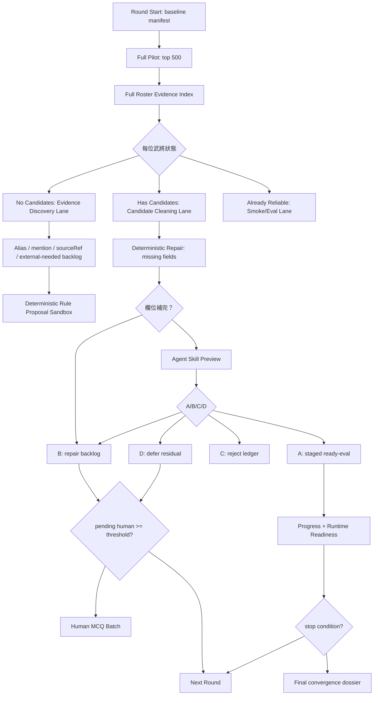

<!-- doc_id: doc_tech_0081 -->
# 全量武將收斂高速公路設計

> 補充：若要看 v2 的信任評分、雙分數規則、女性角色加權與反芻降級，請直接看 [full-roster-confidence-rag-highway.zh-TW.md](./full-roster-confidence-rag-highway.zh-TW.md)。

這份文件設計一條新的 Sanguo ETL/RAG 高速公路管線，目標是把「全量武將」都放進同一個可重複、自動收斂、可停在人工閘門前的循環裡。原本的 ABAB / three-lane 管線不改動，這條新管線只把現有腳本當子程序呼叫，並額外補上「無 candidate 的 evidence discovery lane」與「全 roster 狀態追蹤」。

Unity 對照：原本 ABAB 像 `AssetPostprocessor + Inspector 修補 + Build Validation`，適合拿已經進 repair backlog 的高價值素材精修；這條高速公路更像全專案的 `Reimport All + Dependency Cache + Validation Dashboard`，每個武將都是一個 asset，都要有清楚的 import 狀態、缺證據原因、下一步處理 lane。

## 核心答案

可以做，而且方向是對的。真正有效率的設計不是把 500 人全部丟給 LLM 審，而是每一輪都讓 500 人全部進入 cheap deterministic scan，然後只把「真的有候選、有證據、有機會升級」的人送到較貴的 skill preview。人工只處理超過門檻、且自動流程已經無法安全裁決的題目。

這樣會形成你說的正循環：

1. 人工少量裁決會變成 alias、location、relationship、event-boundary 的規則。
2. 規則回到 deterministic extractor，下輪可自動補更多欄位。
3. 原本 B 或 unknown 的候選，因為新規則與新 evidence 變成 A。
4. A 進 staged ready-eval，再提升 pilot / progress / runtime readiness。
5. 沒有新 evidence、delta 太低或人工題爆量時才停。

## 新管線名稱

建議新腳本叫：

```text
run_full_roster_convergence_loop.py
```

建議報表主目錄：

```text
local/codex-smoke/knowledge-growth/<run-id>/
```

建議預設命令：

```bash
python server/npc-brain/pipelines/sanguo-rag/run_full_roster_convergence_loop.py \
  --run-id full-roster-r1 \
  --top 500 \
  --batch-size 100 \
  --angle-pack battle,relationship,life,work,governance,diplomacy,equipment \
  --human-question-threshold 20 \
  --max-rounds 8 \
  --no-new-evidence-patience 2 \
  --overwrite
```

## 大白話流程

每一輪都像洗一批食材，但不是把所有食材都丟進同一台昂貴機器。先全量過篩，再分流。

第一層是全量掃描：500 位武將全部跑 pilot、mentions、events、generic candidates、keywords、persona readiness。這一步便宜，而且一定全量。

第二層是找證據：有 candidate 的人去 candidate review；沒有 candidate 的人不能跳過，要進 evidence discovery lane，找他到底是沒有出現、alias 沒對上、sourceRef 沒被抽到，還是需要外部資料。

第三層是自動修補：缺 location、relationshipEdges、event boundary 的候選，先用 deterministic 規則補。補完同輪立刻二次檢查，不等下一輪。

第四層是 skill preview：只把欄位完整或修補後可判斷的候選送進 agent skill preview。agent 只能產生 proposal，不直接寫正式資料。

第五層是人工閘門：如果人工待審未滿 20，就不打擾你，繼續跑下一批或下一輪；如果滿 20，就輸出看得懂的中文題目、原文線索、上下文、A/B/C/D 說明。

第六層是收斂：A 進 staged ready-eval，B 進 repair backlog，C reject，D defer。下一輪重新全量 pilot，觀察哪些人升級、哪些人仍卡住。

## 總流程圖



## 每位武將都要有狀態

高速公路的關鍵不是「跑完腳本」，而是每位武將都要有一張 scorecard。無 candidate 的人也必須有列，不可以消失。

建議每輪產出：

```json
{
  "generalId": "zhang-jue",
  "displayName": "張角",
  "roundId": "full-roster-r1-r003",
  "evidenceTier": "candidate-evidence",
  "reliabilityStatus": "repairable",
  "readyEventCount": 2,
  "genericCandidateCount": 1,
  "mentionCount": 8,
  "evidenceRefCount": 3,
  "missingFields": ["relationshipEdges"],
  "nextLane": "deterministic-repair",
  "lastDelta": 0.7,
  "humanPendingCount": 0,
  "canonicalWrites": false
}
```

建議狀態如下：

- `trusted-ready`：已經有足夠 source-grounded ready/eval event，可進 runtime smoke。
- `candidate-evidence`：有 candidate，可進 deterministic repair 或 skill preview。
- `repairable`：有證據但缺欄位，先補欄位。
- `discoverable-cold`：有 mention 或 alias 線索，但還沒有 candidate。
- `source-cold`：roster 有這人，但 corpus 目前幾乎找不到他。
- `external-source-needed`：內部文本不足，需要外部來源或人工指定 seed。
- `blocked-human`：自動流程無法安全判斷，累積到門檻才出人工題。
- `rejected-or-noise`：已判定不是有效事件或不是有效人物線索。

## Evidence Discovery Lane

這是目前缺的核心 lane。沒有 candidate 的武將不能直接略過，因為略過就永遠不會長大。

Evidence Discovery Lane 要做四件事：

- 查 `generals.json` 與 manual roster seed，確定這個人是否在正式 roster。
- 查 observed mentions，找是否有本名、字、稱號、官職、別名或誤切詞命中。
- 查 source packets / chunks，找是否有 sourceRef 可以支持事件抽取。
- 判斷缺的是 alias、source coverage、event extractor taxonomy，還是需要外部資料。

舉例：

```text
武將：某小將
狀態：discoverable-cold
原因：observed mentions 有 3 次，但 alias 未連到 generalId
下一步：產生 alias rule proposal，sandbox 跑 collect_observed_mentions -> extract_event_candidates
```

再舉例：

```text
武將：某地方人物
狀態：source-cold
原因：全書 sourceRef 找不到可用 mention
下一步：列入 external-source-needed，不送 skill preview，避免幻覺補資料
```

## 兩段驗證法

你提的「決定型修正 -> skill preview 修正 -> pass 人工」是對的，我建議實作成三層 gate。

第一層：deterministic repair。

能用規則補的就先補，例如 location 從同 sourceRef 的地名候選補、relationshipEdges 從同段 participant + 關係動詞補、summary boundary 從 sourceQuote 重切。

第二層：agent skill preview。

只有在 sourceQuote、sourceRefs、generalIds、summary 邊界足夠時才送。agent 只能回答 A/B/C/D 與 edits proposal。嚴禁直接寫 canonical。

第三層：human gate。

只有 pending >= 20 或同一 residual 重複太多次時才輸出人工題。人工題必須包含「題目在問什麼」、「原文線索」、「中文摘要」、「上下文」、「A/B/C/D 中文意思」、「推薦判定與理由」。

## 為什麼會越跑越快

這條高速公路會快，是因為每輪都把人工與 skill 的成果變成下一輪 deterministic 的燃料。

範例一：你裁決「張梁、張寶在潁川與皇甫嵩、朱雋對壘」這類句型可以產生 battle candidate。下一輪 extractor 就能把「X 在地點與 Y 對壘」變成 deterministic pattern，不用再問你。

範例二：某人常用字號或官稱出現。人工或 skill 確認一次後，下一輪 alias dictionary 會命中更多 observed mentions，原本無 candidate 的人會變成 discoverable，再進 candidate cleaning。

範例三：relationshipEdges 常缺。當幾種關係動詞通過 sandbox regression 後，下一輪 B 會下降，A 會增加。

## 角度包設計

後面你想收集生活習慣、小活動、團體活動、休閒活動，這不該硬塞在 battle extractor 裡。高速公路要支援 angle pack。

建議第一批 angle pack：

- `battle`：戰役、對壘、圍城、追擊、伏擊、救援。
- `relationship`：師徒、父子、兄弟、同盟、敵對、投降、背叛。
- `life`：宴會、閒談、拜訪、家務、旅行、傳聞、教育。
- `work`：當官、當兵、當賊、農作、商旅、工匠、乞討、宗教活動。
- `governance`：任官、政令、農政、賑災、稅收、工程。
- `diplomacy`：使節、結盟、納降、婚盟、人質、朝貢。
- `equipment`：武器、馬匹、鎧甲、印綬、書信、贈禮。
- `affect`：忠誠、恐懼、仇恨、敬重、羞辱、野心、保護家人。

每個 angle pack 都產生自己的 candidates、repair rules、acceptance metrics。這樣新增「生活習慣」時，不會污染戰役候選，也能清楚看到哪個角度最會長資料。

## 控制器決策原理

每輪控制器要先全量 cheap scan，再決定 expensive work 的順序。

建議優先序：

1. 先跑 `--top 500` pilot，產生全 roster 狀態。
2. 先清有 candidate 且 deterministic 可修的人，因為最便宜。
3. 再清有 candidate 且 skill preview 可判斷的人。
4. 再處理 discoverable-cold，也就是有 mention 但 candidate 不足的人。
5. source-cold 不送 skill，先列外部 evidence / manual seed backlog。
6. 人工 pending 未滿 20 時繼續跑；滿 20 才輸出人工題。

排序分數可以這樣估：

```text
priority =
  genericCandidateCount * 5
  + mentionCount * 2
  + evidenceRefCount * 3
  + importantGeneralBoost
  - humanPendingPenalty
  - sameResidualPenalty
```

這會讓「有機會快速升級」的人先被處理，而不是盲目照 roster 順序。

## 自我進步循環

自我進步可以做，但只能產生 rule proposal，不可自動把規則寫進正式 extractor。

每輪 residual dossier 要歸納：

- 常見 alias miss。
- 常見 location miss。
- 常見 relationship edge miss。
- 常見 event boundary miss。
- 常見 false positive。
- 哪些 angle pack 沒有足夠 taxonomy。

然後產生：

```text
rule-proposals/r003-alias-location-relationship.json
sandbox-regression/r003-report.json
human-rule-approval.todo.json
```

只有 sandbox regression 通過後，才可以把規則列成「建議納入 extractor」。正式納入仍走人工 gate 或 commit review。

## 停止條件

自動循環不能無限跑，要有清楚停止條件。

- `humanPendingCount >= 20`：停下來輸出人工題。
- `newEvidenceCount == 0` 連續 2 輪：停，代表內部資料暫時吃完。
- `overallPercentDelta < 0.05` 連續 2 輪：停，代表收益太低。
- `sameResidualRepeat >= 2`：停，避免同一批問題空轉。
- `failureRate > 20%`：停，先修 pipeline。
- `runtimeReadiness failCount > 0`：不進 promotion，只輸出 fail rows。
- `maxWallTimeMinutes` 到：保存 manifest，下次續跑。

## Artifact 目錄

建議每次 run 都留下完整可追蹤輸出。

```text
local/codex-smoke/knowledge-growth/full-roster-r1/
  baseline-manifest.input.json
  full-pilot/
    etl-quality-pilot-report.json
    etl-quality-pilot-report.md
  roster-scorecards/
    r001.scorecards.jsonl
    r001.summary.md
  evidence-discovery/
    discoverable-cold.jsonl
    source-cold.jsonl
    external-source-needed.jsonl
  candidate-cleaning/
    batch-000/
    batch-100/
    batch-200/
  deterministic-repair/
    repair-proposals.jsonl
    sandbox-report.json
  skill-preview/
    preview-summary.json
    preview-summary.md
  human-gate/
    human-review-batch.todo.json
    human-review-batch.zh-TW.md
  staged/
    staged-ready-eval-events.jsonl
    staged-relationship-evidence.jsonl
  convergence/
    r001-convergence-summary.json
    r001-convergence-summary.md
  baseline-manifest.output.json
```

## 新腳本最小切法

原管線不要動的前提下，建議新增四支腳本。

第一支：`build_full_roster_evidence_index.py`。

負責讀 `generals.json`、ready events、generic candidates、observed mentions、source packets，輸出每位武將的 evidence scorecard。

第二支：`build_evidence_discovery_backlog.py`。

負責把無 candidate 的人分成 `discoverable-cold`、`source-cold`、`external-source-needed`，並產生下一輪可嘗試的 alias / source / angle proposal。

第三支：`run_full_roster_candidate_batches.py`。

負責用 offset `0/100/200...` 分批呼叫 `run_knowledge_growth_round.py`，只處理 candidate pool，不碰 cold pool。

第四支：`run_full_roster_convergence_loop.py`。

總控腳本。負責跑 full pilot、scorecard、evidence discovery、candidate batches、stage、estimate、stop condition、baseline manifest。

## 第一版實作順序

第一版不要急著做到全自動學規則。先讓每個武將不再消失。

1. 新增 full roster scorecard，讓 top 500 每人都有狀態。
2. 新增 evidence discovery backlog，無 candidate 的人也會被列出原因。
3. 新增 batch runner，offset `0/100/200...` 清 candidate。
4. 新增 convergence summary，顯示本輪 A/B/C/D、cold、delta、pending human。
5. 再接 deterministic rule proposal sandbox。
6. 最後才把 rule proposal 接進 extractor 擴充。

## 成功標準

第一階段成功，不是 500 人全變 ready，而是 500 人全都有「可解釋的下一步」。

可驗收指標：

- full pilot 選到 500 或實際 roster 全數。
- scorecard row 數等於 selected general 數。
- `genericCandidateCount == 0` 的人全部進 evidence discovery lane。
- candidate batch 可以用 offset 分批清理，不會因 cold generals 空轉。
- pending human 未滿 20 時繼續自動跑。
- pending human 達 20 時輸出中文可讀人工題。
- 每輪輸出 baseline manifest，可續跑。
- `canonicalWrites=false`，正式 promotion 仍需人工 gate。

## 結論

這條高速公路的重點是：全量武將每輪都進場，但不是每個人都用同一種昂貴處理方式。便宜的 deterministic 掃描全量跑，昂貴的 skill preview 只跑高機率候選，人工只處理自動流程累積到門檻後仍無法裁決的題目。

這會比目前三車道更符合「越洗越乾淨、越跑越快」的目標，也能承接未來新的分析角度，例如生活習慣、休閒活動、團體活動、職業活動與決策偏好。
