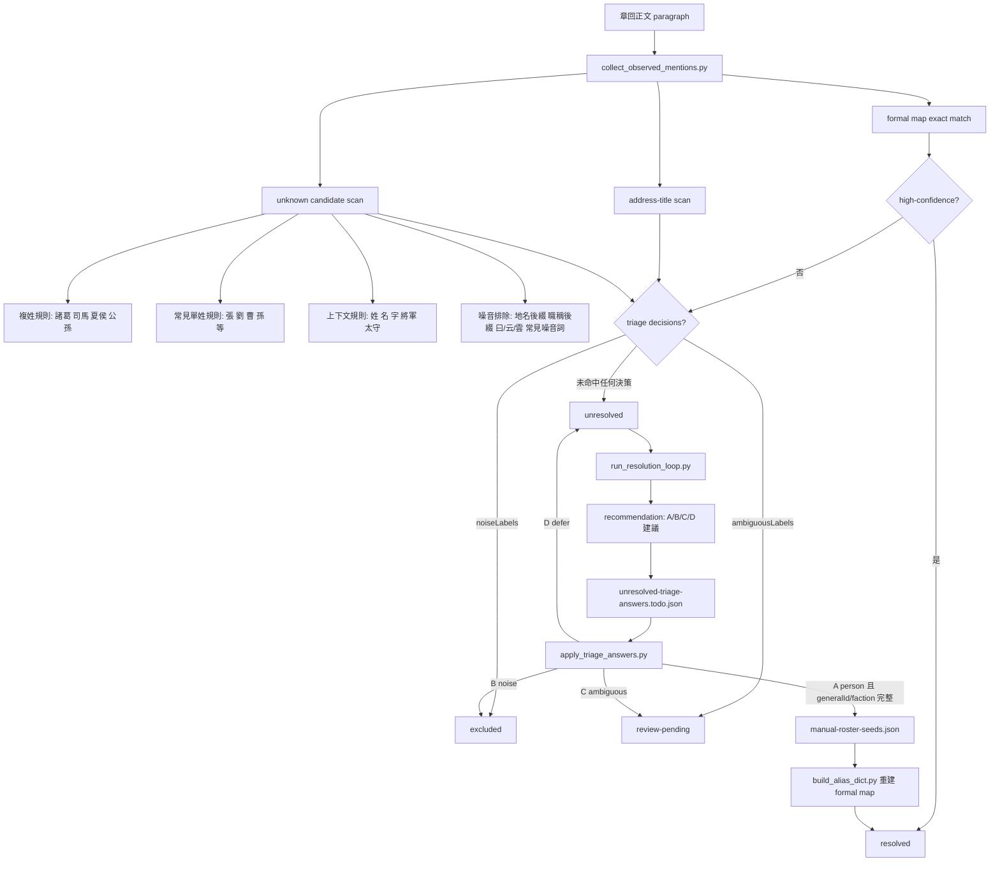

# 人名事件解析

這份文件把 Sanguo RAG 的「文本中出現一段像人名的字串」如何一路被掃到、分流、保留為 unresolved，或最終變成 resolved，整理成一張簡圖與一套規則表。

核心腳本：

- `collect_observed_mentions.py`
- `build_alias_dict.py`
- `run_resolution_loop.py`
- `apply_triage_answers.py`

## 流程簡圖

## 一、前段抓取規則

### 1. formal map exact match

先拿 `formal-mention-map.json` 逐段掃正文。只要字串已存在於正式 alias map，就先記成 `formal-match`。

- 若 alias map 狀態是 `high-confidence`，這筆 mention 直接算 `resolved`。
- 若 alias map 狀態不是 `high-confidence`，它不會直接 resolved，而是先保留給 triage 分流。

這一層處理的是「我們已經正式知道它是誰」的稱呼。

### 2. address-title scan

第二層會補抓固定稱呼詞，例如：

- `將軍`
- `軍師`
- `先生`
- `主公`
- `太守`
- `丞相`

但只有在這個詞是獨立出現、前後不是連續 CJK 字時，才算一筆獨立事件。這是為了避免把更長詞裡面的局部片段誤當成稱呼。

### 3. unknown candidate scan

這一層才是真正的「看起來像人名」候選掃描。預設走 `conservative` 模式，不是任意抓所有 2 到 4 字中文片段。

主要規則：

- 複姓優先：例如 `諸葛`、`司馬`、`夏侯`、`公孫`。
- 常見單姓：例如 `張`、`劉`、`曹`、`孫`、`趙`、`馬` 等。
- 長度通常落在 2 到 4 字。
- 如果周圍上下文出現 `姓 / 名 / 字 / 一名 / 將軍 / 太守 / 校尉 / 中郎將` 等訊號，會更傾向保留。

### 4. 噪音排除規則

候選字串即使長得像人名，也不一定會被保留。掃描時會排除多種明顯非人名情況：

- 命中硬編碼噪音詞，例如 `後人贊曰`、`卻說`、`次日`、`下文`。
- 含有常見非姓名功能字。
- 以地名後綴結尾，例如 `城 / 郡 / 州 / 縣 / 關 / 山 / 江 / 河`。
- 以職稱結尾，例如 `將軍 / 軍師 / 太守 / 主公`。
- 結尾是 `曰 / 云 / 雲`。
- 像 `陳留王`、`馬步兵`、`錢糧` 這類更像複合詞、官稱片段、物資詞的情況。

也就是說，這層的目標不是「盡量多抓」，而是「先抓出值得人工或後續規則再看的候選」。

## 二、什麼情況會變成 unresolved

`unresolved` 是這條管線的預設待判定狀態。

只要一個 label 符合以下條件，就會留在 `unresolved`：

1. 它沒有命中 `high-confidence` formal alias。
2. 它不在 `noiseLabels`。
3. 它不在 `ambiguousLabels`。
4. 它還沒有經過 `A person` + 正式 apply 流程，被寫回 manual roster 並重建 formal map。

換句話說，`unresolved` 的意思不是「它一定是人物」，而是：

> 這個字串已經值得追蹤，但目前系統還沒有足夠正式證據把它歸到 resolved / excluded / review-pending 其中之一。

## 三、triage 後四種去向

### A person

代表「確定是人物」。

但只有在 `personRecord.generalId` 與 `personRecord.faction` 都完整時，`apply_triage_answers.py` 才能把它正式寫進 `manual-roster-seeds.json`。

接著要再跑一次：

1. `build_alias_dict.py`
2. `collect_observed_mentions.py`
3. `run_resolution_loop.py`

等 formal map 重建完成，這個 label 下一輪才會真正變成 `resolved`。

### B noise

代表「確定不是人物」。

這類 label 會進 `noiseLabels`，之後在 collector 中改記成 `excluded`，不再占用 unresolved 配額。

典型例子：

- 物資詞
- 官稱片段
- 斷詞噪音
- 套語片段

### C ambiguous

代表「目前有用，但暫時不適合硬判成人物或噪音」。

這類 label 會進 `ambiguousLabels`，之後被分流到 `review-pending`。

它的意義是：

- 不讓 unresolved 一直被卡住
- 但也不假裝已經 resolved

### D defer

代表「本輪先不處理」。

這個選項不會改變任何正式 config，所以它下一輪仍然會留在 `unresolved`，之後可能再被出題一次。

## 四、recommendation 的角色

`run_resolution_loop.py` 會根據兩大證據源提供 `A/B/C/D` 建議：

- 《三國演義角色列表》
- 本地 curated person index（`manual-roster-seeds.json` + `general-alias-overrides.json`）

另外也會看 sample snippet 是否反覆出現在明顯複合詞裡，例如：

- `陳留王`
- `馬步兵`
- `錢糧`

如果人名訊號與噪音訊號互相衝突，recommendation 會傾向保守，轉成 `C ambiguous` 或低信心 `D defer`。

注意：

> recommendation 只是建議，不等於正式 resolved。

只有當 triage 答案被正式 apply，並且 alias map 重建成功後，結果才會真正落進 resolved / excluded / review-pending。

## 五、一句話版判斷準則

- **被掃到**：因為它像 alias、稱呼詞，或像一段可能的人名。
- **變 unresolved**：因為它值得追蹤，但目前還沒有被正式證明是誰，也沒有被正式排除。
- **離開 unresolved**：只有在它被正式歸到 `resolved / excluded / review-pending` 其中之一之後。