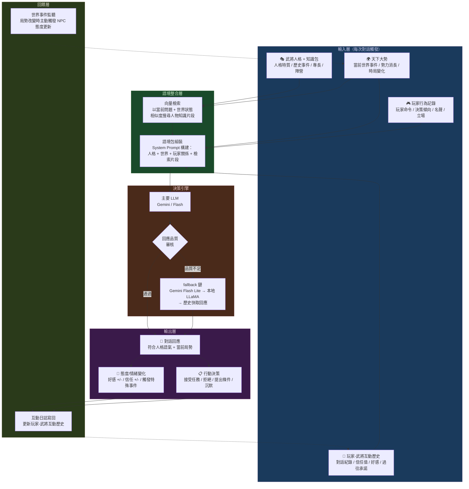

<!-- doc_id: doc_server_other_0008 -->
# NPC 最終行為決策流程圖

> 文件使用原則：
> - 本文假設你正在使用 standalone `3klife-npc-brain` repo。
> - `<repo-root>` 代表你自己 clone 下來的專案根目錄。
> - 若本文包含啟動或驗證指令，預設以 Docker 為正式開發環境來源；本機 Python / venv 僅用於 IDE debug、LangGraph dev 或臨時工具。

**doc_id**: doc_server_service_0009  
**分類**: 遊戲 Runtime 決策層  
**對應文件**: [README](../README.md) | [向量檢索與資料入庫](./向量檢索與資料入庫.md) | [對話服務與模型回退](./對話服務與模型回退.md)

---

## 先講結論

NPC 的每一句回應都是三個「語境層」合流的結果：

| 層 | 內容 | 來源 |
|---|---|---|
| 武將本體 | 人格特質、歷史知識包 | PostgreSQL + 向量索引 |
| 天下大勢 | 當前世界事件、局勢變化 | PostgreSQL 世界狀態表 |
| 玩家關係 | 互動紀錄、信任度、好感度 | 玩家行為日誌 + 互動歷史 |

缺少任何一層，NPC 的回應就會「去語境化」——說出歷史上正確但與當前局勢無關的話。

---

## NPC 最終行為決策流程



---

## 各層詳解

### 武將本體（A1）

武將人格與知識包是 NPC 的「靈魂」，決定**說話風格**和**知識邊界**。

- 人格特質：忠義度、暴躁指數、謀略傾向（從 `general_configs` 讀取）
- 歷史知識：經歷的戰役、人際關係、師承（從 ABAB 審核產出的 events）
- 專長與陣營：武官/文官/謀士、效忠勢力

### 天下大勢（A2）

NPC 不是活在真空中的歷史角色，而是**知道當前局勢**的角色。

```
世界事件觸發範例：
- 曹操剛在官渡勝袁紹 → 夏侯惇提到此事時信心大增
- 劉備失去荊州      → 諸葛亮的所有回應都帶憂鬱基調
- 玩家叛投曹操      → 關羽立刻進入「失望/警戒」模式
```

### 玩家行為記錄（A3）

武將對「這個玩家」的整體印象：

- 玩家過去的決策是否符合武將的價值觀？
- 玩家的名聲（義士？暴君？謀略型？）
- 玩家與武將同陣營還是對立？

### 玩家-武將互動歷史（A4）

這是最細粒度的情感層，記錄**這對 (玩家, 武將) 的雙邊關係**：

| 欄位 | 說明 |
|---|---|
| `trust_level` | 信任值 0–100 |
| `favor_score` | 好感分數（可負值） |
| `last_promise` | 上次的承諾或協議 |
| `interaction_count` | 互動次數（影響熟悉度語氣） |
| `key_events` | 重要節點（第一次見面、背叛、拯救）|

---

## 語境整合（B1/B2）的核心邏輯

```
語境包 = 人格描述
       + 當前世界事件摘要（最近 3 件大事）
       + 玩家關係摘要（信任/好感/記憶）
       + 向量搜尋出的知識片段（top-3 相關歷史事件）
       + 本輪玩家輸入
```

向量搜尋在這裡扮演「記憶召回」角色——NPC 不會記住所有歷史細節，但在提到相關話題時，會從知識索引中喚起對應記憶。

---

## 回饋閉環的重要性

決策流程不是單向的。輸出後：

1. **互動日誌更新**：每次對話都寫回 A4，讓下次的語境包更準確
2. **世界事件監聽**：天下大勢改變時，不需要等玩家問，NPC 的態度基準值就已更新

這讓 NPC 產生「時間感」——同一個武將，在赤壁之戰前後問同一個問題，會給出本質上不同的答案。

---

## 相關文件

- [向量檢索與資料入庫](./向量檢索與資料入庫.md)：向量搜尋技術細節
- [對話服務與模型回退](./對話服務與模型回退.md)：LLM fallback 鏈實作
- [武將基本資料從0到1的誕生](./武將基本資料從0到1的誕生.md)：武將知識包如何建立
- [資料契約與 Cocos 串接](./資料契約與Cocos串接.md)：玩家行為日誌 DTO 規格
