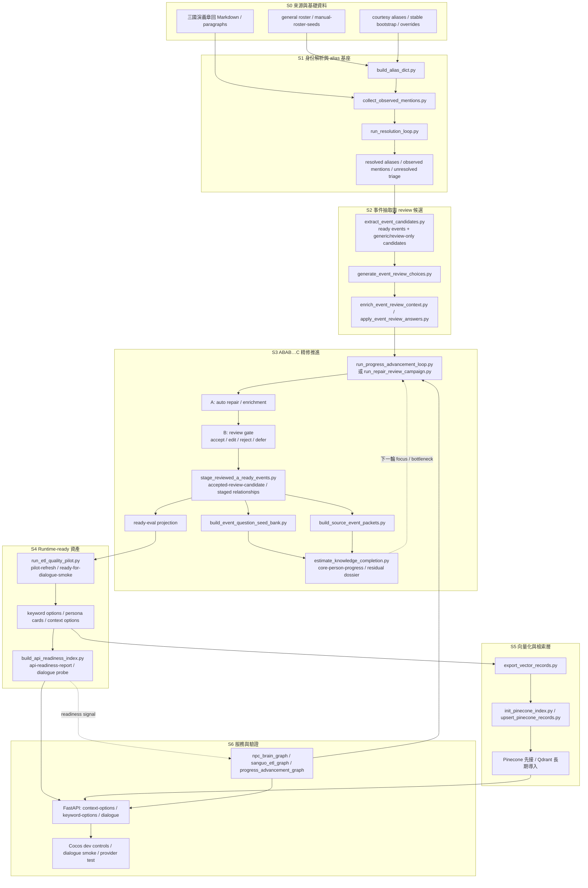

<!-- doc_id: doc_server_service_0002 -->
# 三國人物資料推進流程

> 說明三國人物資料如何從章回文本、名單與人工 seed，一路推進成可供 npc-brain runtime 使用的 persona / keyword / context / readiness 資產。

## 這份文件適合什麼時候看

- 想快速理解「人物資料到底是怎麼被做出來的」
- 想判斷目前卡在 alias、review、readiness，還是 vector / runtime
- 想知道 ABAB…C 精修流程在整條生產線中的位置

本文件專注在**人物資料生產線**；如果你要看：

- 單一武將如何從 0 長成可用資料：改看《武將基本資料從0到1的誕生》
- runtime 對話與 fallback：改看《對話服務與模型回退》
- Pinecone / Qdrant / PostgreSQL：改看《向量檢索與資料入庫》
- 前端 DTO / Cocos：改看《資料契約與 Cocos 串接》

## 流程總圖

## 六個階段在做什麼

### 1. 身份基座

先解決「章回裡這個稱呼到底是誰」：

- 字、號、別名、官銜
- observed mentions
- unresolved triage

這一步的目的不是產出台詞，而是避免後面 event / relation 一開始就綁錯人物。

### 2. 事件抽取與 review 候選

從章回中抽取：

- 可直接進入後續流程的 ready events
- 需要人工或半自動檢視的 review-only candidates

低信心事件先進 review queue，不直接進 runtime-ready 資產。

### 3. ABAB…C 精修推進

這是目前人物資料推進的核心 lane：

- A：自動修補、補 location、關係與 context
- B：人工 / 半人工 review gate
- C：把殘留問題收斂成下一輪可處理的 dossier

這條線的目標不是大量吞吐，而是把高價值人物逐步壓到可 smoke 的品質。

### 4. Runtime-ready 資產

把已通過 gate 的事件轉成 runtime 需要的結構：

- keyword options
- persona cards
- context options
- API readiness report

`run_etl_quality_pilot.py` 與 `build_api_readiness_index.py` 是目前最關鍵的 readiness gate。

### 5. 向量化與檢索

當人物資產已經足夠穩定，就匯出統一的 vector-ready records：

- facts
- keywords
- persona

目前先上 Pinecone；長期會切到 Qdrant，但 canonical truth 仍不在向量庫。

### 6. 服務與驗證

最後由：

- FastAPI
- LangGraph Studio
- Cocos dev controls

共同消費這些 artifact，驗證 keyword options、dialogue、provider fallback 與 readiness。

## 幾個重要 gate

### `accepted-review-candidate` 不是最終 ready

`stage_reviewed_a_ready_events.py` 產出的新事件，仍需要經過 `ready-eval projection`，才會正確進入 pilot / readiness。

### `ready-for-dialogue-smoke` 是目前的重要里程碑

它代表：

- persona / keyword / context 已成形
- 對話 probe 已可驗證
- 可以切回 runtime 對話 smoke 測試

### 向量庫不是 canonical truth

向量索引只負責召回，真正的真相來源仍是：

- pipeline 產生的結構化 artifact
- 後續的 PostgreSQL / JSONB 真相層

## 推進策略建議

如果目標是大量角色同時前進，建議把工作拆成兩條 lane：

1. **Bulk coverage lane**：先做廣度，讓更多人物從 0 到可評估。
2. **ABAB precision lane**：只精修高價值、接近 ready 的人物。

ABAB…C 本身比較像精修流程，不適合直接拿來做大規模吞吐。

## 相關文件

- [README.md](../README.md)
- [武將基本資料從0到1的誕生](./武將基本資料從0到1的誕生.md)
- [對話服務與模型回退](./對話服務與模型回退.md)
- [向量檢索與資料入庫](./向量檢索與資料入庫.md)
- [資料契約與 Cocos 串接](./資料契約與 Cocos 串接.md)
