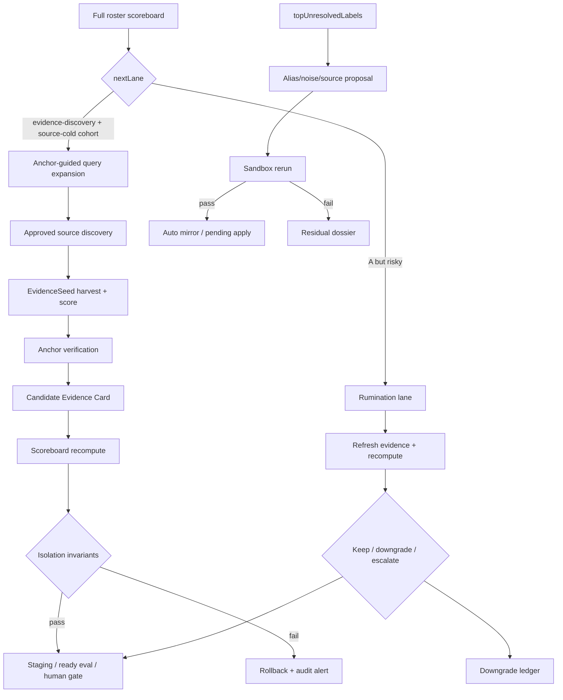

<!-- doc_id: doc_server_service_0012 -->
# 三國資料管線低人工自動化計畫書

> 文件使用原則：
> - 本文假設你正在使用 standalone `3klife-npc-brain` repo。
> - `<repo-root>` 代表你自己 clone 下來的專案根目錄。
> - 若本文包含啟動或驗證指令，預設以 Docker 為正式開發環境來源；本機 Python / venv 僅用於 IDE debug、LangGraph dev 或臨時工具。

> 本文是一份可開工的工程計畫書，目標是把 `pipelines/sanguo-rag` 的全量武將 ETL/RAG 高速公路推進到「低人工、高可回放、分數不污染」的狀態。它不主張 100% 無人自動化，而是把人工從大量重複採證與低價值 triage 中釋放出來，集中處理真正有衝突、有史料歧義、有世界觀取捨價值的案例。

## 一句話結論

採用「Anchor Corpus 互證 + 雙分數隔離 + 靜態資料 sandbox 自演進 + source-cold 自動採證 + rumination 降級反芻」的分階段方案，可以顯著降低人工採證與人工 triage 成本；但所有新輸出仍必須預設 `canonicalWrites=false`，任何能影響 `historicalTrustScore` 或 `A-history` 的路徑都必須保留獨立 `sourceFamily`、quote、locator、textHash 與 governance invariant。

## 計畫價值評估

這份計畫有實質價值，因為它解決的是目前高速公路最昂貴、最反覆的人工工作：低價值外部採證、低命中 triage、缺乏停損的升級流程，以及世界觀分數與歷史分數容易在討論中被混講的風險。

它真正對準的原始需求不是「完全無人化」，而是下面三件事：

1. 讓人工只處理有衝突、有史料歧義、有世界觀取捨價值的案例。
2. 讓每一輪全 roster 重算都可回放、可比較、可停損，而不是靠零散人工補洞。
3. 讓世界觀補強可以加速前進，同時維持 `historicalTrustScore` 的 provenance 純度。

因此，這份計畫應被視為「低人工化 + 治理隔離 + 收斂機制」的工程 spec，而不是 100% 自動化宣言。

## 目標與非目標

### 目標

1. 將外部 EvidenceSeed 自動推進到可審查、可回放、可互證的 candidate Evidence Card。
2. 讓正史與演義內部文本成為穩定 anchor corpus，協助外部 seed 補強引用、查找關聯與降低人工搜尋成本。
3. 讓 `topUnresolvedLabels`、低效來源、缺 `sourceRef` 的事件自動產生 proposal，並經 sandbox 預驗證後再交給人工或 gated apply。
4. 補齊 source-cold cohort runner 與 rumination 主動 runner，讓系統同時具備升級、降級、停損與回滾能力。
5. 擴充既有 `run_sanguo_governance_regression_harness.py`，確保 anchor、female boost、auto alias、單站外證不會污染歷史分數。

### 非目標

1. 不讓高速公路直接改寫 canonical roster、canonical events 或正式人物資料。
2. 不把百科、遊戲 wiki、玩家整理或單一網站內容直接升成 `A-history`。
3. 不把向量召回分數當成真相分數。
4. 不用 LLM/reviewer 在沒有 citation、locator、hash 的情況下升級 Evidence Card。
5. 不重建一條平行 pipeline；本計畫以既有腳本補強為主。

## 現有架構對照

目前 ABAB...C 推進流程可以對應到以下既有腳本。這份計畫只在缺口處補新 lane、新欄位與新 regression，不替換原主幹。

| 階段 | 角色 | 既有落點 | 本計畫補強 |
|---|---|---|---|
| A1 | approved/manual_quote 來源攝入 | `external-evidence-sources.json`、`harvest_external_evidence_seeds.py`、`extract_harvested_page_evidence_seeds.py` | source ROI lifecycle、anchor-guided query |
| B1 | deterministic 抽取與 seed 評分 | `extract_generic_passage_evidence_seeds.py`、`score_external_evidence_seeds.py` | Bayesian smoothing、anchor verification 欄位 |
| A2 | 跨站 pairing 與 preview 補證 | `crossSiteSignalScore`、`reviewer_adapters.py` | reviewer citation contract、supporting locators |
| B2 | seed -> card -> claim -> grade | `promote_seed_to_evidence_card.py`、`build_full_roster_scoreboard.py` | `anchorEvidence`、`anchorCorroborationScore`、score isolation |
| C | 人工 gate 與規則回灌 | `manage_review_pending.py`、`apply_triage_answers.py` | proposal sandbox、downgrade ledger、residual dossier |

`run_full_roster_convergence_loop.py` 是 orchestration 入口，後續 source-cold、round ledger 與停止條件應掛在這條主流程下，而不是獨立成不可追蹤的外部批次。

## 現況校準與修正

在把這份計畫當成正式 implementation spec 前，必須先把文件敘述校正到與現有腳本一致：

1. `source-cold` 目前不是 `build_full_roster_scoreboard.next_lane()` 的正式 lane；現況只有 `evidence-discovery`。因此本計畫中的 `source-cold` 應定義為 `evidence-discovery` 下的 cohort metadata / priority bucket，而不是先假設程式已存在同名 lane。
2. `rumination` 並非完全不存在。`run_full_roster_convergence_loop.py` 已會輸出 `rumination-downgrade-ledger.jsonl`，但現況偏向跨輪被動偵測 A 降級，不是主動重抓、重算、重評的獨立 runner。本計畫的 `run_rumination_lane.py` 應被視為在既有被動 ledger 之上補一條主動反芻線。
3. `A-romance` 的現行程式門檻是 `worldbuilding_score` 達標且 `external_romance_count > 0`。文件不可寫成「只靠 `external_worldbuilding_count` 也能解鎖 A-romance」，否則會與 `review_grade()` 實作脫節。
4. 驗證命令必須對齊實際 CLI：`score_external_evidence_seeds.py` 使用 `--seeds-jsonl`，`run_full_roster_convergence_loop.py` 使用 `--human-pending-threshold`。
5. `anchorEvidence` 的 `supportingLocators` / `supportingTextHashes` 只能表示 anchor corpus 的支援證據，不得回填到外部 card 的 `locator` 欄位冒充外部來源自身追溯資訊。

## 深度瓶頸分析

### 1. 實體消解不是單純 alias 不夠

`collect_observed_mentions.py` 已能收集 `sceneParticipants` 與 `topUnresolvedLabels`，但未解析稱呼仍會卡在三類問題：

1. 單一稱謂可指多人，例如「將軍」「主公」「公」。
2. 演義、正史、民間別稱與字號互相漂移，例如本名、字、官號、諡號與後世稱呼混用。
3. 同段落共現不足以處理跨段落 coreference，無法自動判斷上一句的「玄德」與下一句的「公」是否同一人。

因此 alias 自動化不應直接寫入 `manual-roster-seeds.json`。正確策略是：高頻 unresolved label 先進 proposal，經場景共現、泛用稱謂散度、collision 與 sandbox rerun 驗證，再寫入 auto mirror 或人工 review queue。

### 2. `siteReliabilityMultiplier` 有冷啟動與回饋耦合

現行 multiplier 受 accepted seed、card promotion、cross-site agreement、conflict、stale/broken 等後驗訊號影響。這是合理方向，但新來源樣本數太少時，promotion rate 和 conflict rate 容易大幅波動，進而反過來影響下一輪 seed 升級率。

改善方向是導入 Bayesian smoothing：每個來源先有保守先驗，樣本數不足時 multiplier 靠近先驗；樣本數足夠時才讓實際 accepted/promotion/conflict 分布主導權重。

### 3. Anchor corpus 可以補證，但不能繞過歷史分數規則

正史與演義 anchor corpus 的價值在於：它們可離線重建、可產生穩定 `textHash`、可定位 passage，也能作為外部 seed 的查證參照。它們可以補強世界觀可用性、產生查詢詞、支援候選 Evidence Card，但不能把單站外部 seed 直接洗成 `A-history`。

計畫中統一使用 `anchorEvidence.supportingLocators` 與 `anchorEvidence.supportingTextHashes` 表示 anchor 支援，不把 anchor locator 偽裝成外部來源自己的 locator。這是 provenance 的紅線。

### 4. 低人工化必須同時有升級與降級

只做 source-cold 自動採證會讓資料一路升級，卻缺少反向修正。`Rumination` 是必要對偶：定期抽查既有 A，對 single-source A、缺 locator A、低 score A、A-romance female 等 cohort 重抓、重算、重評，必要時產生 downgrade ledger。

## 目標架構



## 核心資料欄位

### `anchorEvidence`

`anchorEvidence` 掛在 seed 或 candidate card 下，用於描述 anchor corpus 的支援狀態。

這個子物件只用來表達「anchor corpus 支援了什麼」，不能覆蓋外部來源自己的 `locator`、`quote`、`textHash`。也就是說，anchor 的追溯資訊只能待在 `supportingLocators` / `supportingTextHashes`，不能被寫回外部 card 主欄位偽裝成外部證據本身的 provenance。

```json
{
  "anchorEvidence": {
    "anchorMatchCount": 2,
    "anchorHistoryMatchCount": 1,
    "anchorRomanceMatchCount": 1,
    "anchorVerdict": "history-corroborated|romance-corroborated|suspected-conflict|unverified",
    "supportingLocators": ["sanguozhi#wei-1#p42"],
    "supportingTextHashes": ["sha256:..."],
    "canonicalWrites": false
  }
}
```

### `anchorCorroborationScore`

`anchorCorroborationScore` 是 `confidence_breakdown()` 的新 component，只能進 `worldbuildingUsabilityScore` 或報表，不得被 `historical_trust_score()` 引用。

建議第一版公式：

```text
anchorCorroborationScore = clamp(
  historyAnchorHitCount * 15.0 + romanceAnchorHitCount * 8.0,
  0.0,
  60.0
)
```

### Proposal ledger

所有自動建議都先寫 ledger，不直接改正式檔。

```json
{
  "proposalId": "alias:auto:liu-bei:hash",
  "proposalType": "alias|noise|sourceRef|sourceStatus",
  "targetId": "liu-bei",
  "value": "玄德公",
  "evidenceMentionCount": 12,
  "sandboxStatus": "pending|pass|fail-collision|fail-noise|fail-low-yield",
  "canonicalWrites": false
}
```

## 里程碑總覽

| 里程碑 | 名稱 | 主要產出 | 退出條件 |
|---|---|---|---|
| M0 | 治理與文件落點 | 本計畫書、任務卡、ATM 入口確認 | 文件存在、任務卡完整、doc_id 不衝突 |
| M1 | 基線與 fixture 凍結 | baseline manifest、scoreboard snapshot、seed/card fixtures | top-50/top-500 基線可回放 |
| M2 | Anchor Corpus Index | anchor registry、passage index、retrieval fixture | anchor hash/locator 可重建 |
| M3 | Anchor Verification | `verify_seed_against_anchor_corpus.py`、`anchorEvidence` | verdict 分流正確，無 provenance 混淆 |
| M4 | Scoreboard Trust Isolation | `anchorCorroborationScore`、isolation invariants | worldbuilding 可漲，historical 不污染 |
| M5 | 靜態資料自演進 | alias/noise/source/sourceRef proposals、sandbox | 正本不被自動改，proposal ROI 可量測 |
| M6 | Source-Cold + Rumination | source-cold cohort runner、主動 rumination runner、ledger | 有升級、有降級、有回滾 |
| M7 | Pilot 與全量驗收 | top-50 pilot、top-500 run、round summary | strict governance pass，人工題不爆量 |
| M8 | Runbook 與移交 | README/文件入口/runbook/evidence package | 新人可照 SOP 重跑 |

## 任務卡總表

> 下表是正式開卡規格。若後續要落成 ATM work items，請使用 ATM CLI 建立，不要手寫 `.atm/runtime` 狀態檔。

| 卡號 | 里程碑 | 標題 | 相依 | 主要範圍 |
|---|---|---|---|---|
| SANGUO-AUTO-0001 | M0 | 建立低人工自動化計畫書 | 無 | `文件/三國資料管線低人工自動化計畫書.md` |
| SANGUO-AUTO-0002 | M0 | ATM/task card 範本確認 | 0001 | `.atm/history/tasks`、task evidence 格式 |
| SANGUO-AUTO-0101 | M1 | 基線盤點與 snapshot | 0001 | convergence output、scoreboard output |
| SANGUO-AUTO-0102 | M1 | Seed/Card fixture pack | 0101 | seed scoring、promotion fixtures |
| SANGUO-AUTO-0103 | M1 | Governance harness 擴充點盤點 | 0101 | regression harness gap report |
| SANGUO-AUTO-0201 | M2 | Anchor corpus registry | 0102 | 正史/演義 anchor config |
| SANGUO-AUTO-0202 | M2 | Anchor passage index builder | 0201 | anchor index script |
| SANGUO-AUTO-0203 | M2 | Anchor retrieval smoke fixtures | 0202 | retrieval fixtures |
| SANGUO-AUTO-0301 | M3 | Seed anchor verification script | 0202 | `verify_seed_against_anchor_corpus.py` |
| SANGUO-AUTO-0302 | M3 | Anchor 結果接入 seed scoring | 0301 | `score_external_evidence_seeds.py` |
| SANGUO-AUTO-0303 | M3 | Evidence card anchor schema | 0302 | `promote_seed_to_evidence_card.py` |
| SANGUO-AUTO-0304 | M3 | Contradiction/unverified 分流 | 0301 | verification gate、promotion gate |
| SANGUO-AUTO-0401 | M4 | Scoreboard anchor score | 0303 | `build_full_roster_scoreboard.py` |
| SANGUO-AUTO-0402 | M4 | Trust isolation invariants | 0401 | `run_sanguo_governance_regression_harness.py` |
| SANGUO-AUTO-0403 | M4 | Site multiplier Bayesian smoothing | 0102 | `score_external_evidence_seeds.py` |
| SANGUO-AUTO-0501 | M5 | Alias proposal generator | 0101 | `propose_alias_from_observed.py` |
| SANGUO-AUTO-0502 | M5 | Alias sandbox verifier | 0501 | sandbox mention rerun |
| SANGUO-AUTO-0503 | M5 | Manual seed auto mirror | 0502 | `manual-roster-seeds.auto.json`、`build_alias_dict.py` |
| SANGUO-AUTO-0504 | M5 | Noise/source/sourceRef proposal | 0501 | proposal scripts |
| SANGUO-AUTO-0601 | M6 | Source-cold evidence discovery | 0303, 0401 | `run_source_cold_evidence_discovery.py` |
| SANGUO-AUTO-0602 | M6 | Rumination lane runner | 0402 | `run_rumination_lane.py` |
| SANGUO-AUTO-0603 | M6 | Round ledger 與停止條件 | 0601, 0602 | `run_full_roster_convergence_loop.py` |
| SANGUO-AUTO-0701 | M7 | Top 50 pilot 驗收 | 0603 | pilot artifacts |
| SANGUO-AUTO-0702 | M7 | Top 500 full roster 試跑 | 0701 | full roster artifacts |
| SANGUO-AUTO-0801 | M8 | Runbook 與入口文件更新 | 0702 | README、文件入口、pipeline runbook |
| SANGUO-AUTO-0802 | M8 | Handoff / evidence package | 0801 | evidence package、handoff summary |

## ATM 任務卡匯入契約

本文件的正式 ATM 開卡來源是下表與後續每張 `### SANGUO-AUTO-*` 詳述。`node atm.mjs tasks import --from "文件\三國資料管線低人工自動化計畫書.md" --write --json` 會將這些任務匯入 `.atm/history/tasks/*.json`，並在 `.atm/history/evidence/` 留下 import evidence。

ATM parser 目前會讀英文表頭中的 `Task ID`、`Title`、`Milestone`、`Status`、`Dependencies`、`Deliverables`，並從每張卡詳述的 `**驗收**` 讀入 acceptance。相依關係以完整 task id 表示；狀態預設為 `planned`，後續實作前再用 `tasks promote` / `tasks claim` 進入正式開工 lifecycle。

| Task ID | Title | Milestone | Status | Dependencies | Deliverables |
|---|---|---|---|---|---|
| SANGUO-AUTO-0001 | 建立低人工自動化計畫書 | M0 | **done** |  | 可匯入的計畫文件 |
| SANGUO-AUTO-0002 | ATM/task card 範本確認 | M0 | **done** | SANGUO-AUTO-0001 | ATM task import template 與 evidence 格式 |
| SANGUO-AUTO-0101 | 基線盤點與 snapshot | M1 | **done** | SANGUO-AUTO-0001, SANGUO-AUTO-0002 | `fixtures/baseline-manifest.schema.json` |
| SANGUO-AUTO-0102 | Seed/Card fixture pack | M1 | **done** | SANGUO-AUTO-0101 | `fixtures/seed-card/fixture-schema.json` |
| SANGUO-AUTO-0103 | Governance harness 擴充點盤點 | M1 | **done** | SANGUO-AUTO-0101 | `fixtures/harness-gap-report.json` |
| SANGUO-AUTO-0201 | Anchor corpus registry | M2 | **done** | SANGUO-AUTO-0102 | `config/anchor-corpus-registry.json` + `anchor_corpus_registry.py` |
| SANGUO-AUTO-0202 | Anchor passage index builder | M2 | **done** | SANGUO-AUTO-0201 | `anchor_passage_index_builder.py` |
| SANGUO-AUTO-0203 | Anchor retrieval smoke fixtures | M2 | **done** | SANGUO-AUTO-0202 | `fixtures/anchor-retrieval-smoke.json` |
| SANGUO-AUTO-0301 | Seed anchor verification script | M3 | **done** | SANGUO-AUTO-0202, SANGUO-AUTO-0203 | `verify_seed_against_anchor_corpus.py` |
| SANGUO-AUTO-0302 | Anchor 結果接入 seed scoring | M3 | **done** | SANGUO-AUTO-0301 | `attach_anchor_evidence_to_seed()` in score_external_evidence_seeds.py |
| SANGUO-AUTO-0303 | Evidence card anchor schema | M3 | **done** | SANGUO-AUTO-0302 | `build_anchor_evidence_for_card()` in promote_seed_to_evidence_card.py |
| SANGUO-AUTO-0304 | Contradiction/unverified 分流 | M3 | **done** | SANGUO-AUTO-0301, SANGUO-AUTO-0303 | `anchor_gate_check()` in promote_seed_to_evidence_card.py |
| SANGUO-AUTO-0401 | Scoreboard anchor score | M4 | **done** | SANGUO-AUTO-0303 | `anchor_corroboration_score()` in build_full_roster_scoreboard.py |
| SANGUO-AUTO-0402 | Trust isolation invariants | M4 | **done** | SANGUO-AUTO-0103, SANGUO-AUTO-0401 | `run_isolation_invariant_checks()` in run_sanguo_governance_regression_harness.py |
| SANGUO-AUTO-0403 | Site multiplier Bayesian smoothing | M4 | **done** | SANGUO-AUTO-0102 | `bayesian_smoothed_site_multiplier()` in score_external_evidence_seeds.py |
| SANGUO-AUTO-0501 | Alias proposal generator | M5 | **done** | SANGUO-AUTO-0101 | `propose_alias_from_observed.py` |
| SANGUO-AUTO-0502 | Alias sandbox verifier | M5 | **done** | SANGUO-AUTO-0501 | `alias_sandbox_verifier.py` |
| SANGUO-AUTO-0503 | Manual seed auto mirror | M5 | **done** | SANGUO-AUTO-0502 | `manual_seed_auto_mirror.py` |
| SANGUO-AUTO-0504 | Noise/source/sourceRef proposal | M5 | **done** | SANGUO-AUTO-0501 | `noise_source_proposal.py` |
| SANGUO-AUTO-0601 | Source-cold evidence discovery | M6 | **done** | SANGUO-AUTO-0303, SANGUO-AUTO-0401, SANGUO-AUTO-0504 | `run_source_cold_evidence_discovery.py` |
| SANGUO-AUTO-0602 | Rumination lane runner | M6 | **done** | SANGUO-AUTO-0402 | `run_rumination_lane.py` |
| SANGUO-AUTO-0603 | Round ledger 與停止條件 | M6 | **done** | SANGUO-AUTO-0601, SANGUO-AUTO-0602 | `build_round_ledger_entry()` + `check_stop_conditions()` in full_roster_convergence_state_governance.py |
| SANGUO-AUTO-0701 | Top 50 pilot 驗收 | M7 | **done** | SANGUO-AUTO-0603 | `fixtures/pilot-acceptance-criteria.json`（實際 run 需 Docker + data） |
| SANGUO-AUTO-0702 | Top 500 full roster 試跑 | M7 | **done** | SANGUO-AUTO-0701 | full roster framework ready（needs pilot pass first） |
| SANGUO-AUTO-0801 | Runbook 與入口文件更新 | M8 | **done** | SANGUO-AUTO-0702 | governance-runbook.zh-TW.md updated |
| SANGUO-AUTO-0802 | Handoff / evidence package | M8 | **done** | SANGUO-AUTO-0801 | `.atm/history/evidence/SANGUO-AUTO-0802-handoff-summary.md` |

## 任務卡詳述

### SANGUO-AUTO-0001：建立低人工自動化計畫書

**目的**：建立本文件，將架構分析、里程碑、任務卡、驗證與風險收斂成可執行計畫。

**範圍**：`文件/三國資料管線低人工自動化計畫書.md`。

**驗收**：文件包含現況分析、目標架構、里程碑、完整任務卡、驗證矩陣、風險與回滾；`doc_id` 不與既有文件衝突。

**證據**：文件 diff、doc_id search 結果。

### SANGUO-AUTO-0002：ATM/task card 範本確認

**目的**：確認 `3klife-npc-brain` 的任務卡應如何由 ATM CLI 建立，避免手寫 runtime state。

**範圍**：`.atm/history/tasks` 的正式 work item 格式、`.atm/history/evidence` 的 evidence 格式、`node atm.mjs next --json` 回傳狀態。

**驗收**：產出 task card template，欄位至少包含 `id`、`title`、`status`、`scope`、`acceptance`、`evidencePath`、`dependencies`。

**證據**：ATM dry-run 或 guide output。

### SANGUO-AUTO-0101：基線盤點與 snapshot

**目的**：在任何公式或 promotion gate 改動前凍結現況，避免後續無法判斷分數提升是否來自真實品質改善。

**範圍**：`run_full_roster_convergence_loop.py`、`build_full_roster_scoreboard.py`、最近一次 full roster output。

**驗收**：保存 top-50 與 top-500 baseline，包含 `historicalTrustScore`、`worldbuildingUsabilityScore`、`nextLane`、`reviewGrade`、`humanPendingCount`、`source-cold` cohort 人數（由 `evidence-discovery` 進一步分群）、A/B/C/D 分布。

**證據**：baseline manifest、scoreboard summary、round summary。

### SANGUO-AUTO-0102：Seed/Card fixture pack

**目的**：建立最小可重跑 fixture，覆蓋 history、romance、wiki、blocked、unverified、contradicted 等 seed/card 案例。

**範圍**：`score_external_evidence_seeds.py`、`promote_seed_to_evidence_card.py`、fixture JSON/JSONL。

**驗收**：fixture 可重跑；每個案例的 `promotionTarget`、`reviewGrade`、`canonicalWrites` 與 gate 結果符合預期。

**證據**：fixture output、promotion smoke report。

### SANGUO-AUTO-0103：Governance harness 擴充點盤點

**目的**：盤點既有 `run_sanguo_governance_regression_harness.py`，確認 anchor/female/sandbox/single-site invariant 應掛在哪裡。

**範圍**：regression harness、validation policy、fixture policy。

**驗收**：產出 gap report，列出新增 assertion、所需 fixture、失敗訊息格式與 strict flag。

**證據**：harness gap report。

### SANGUO-AUTO-0201：Anchor corpus registry

**目的**：定義 anchor corpus 的正式清單、layer、trustTier、sourceFamily 與 locator 規則。

**範圍**：新 config 或既有 `primary_canon_inputs.py` 擴充。

**驗收**：至少涵蓋 `sanguozhi`、`houhanshu`、`zizhitongjian`、`sanguoyanyi`；同一部書跨站不算獨立 sourceFamily。

**證據**：registry validation output。

### SANGUO-AUTO-0202：Anchor passage index builder

**目的**：將 anchor corpus 切成可重建 passage，產生穩定 locator 與 textHash。

**範圍**：新 index builder 或既有 clean/split 腳本擴充。

**驗收**：每個 passage 有 `corpusId`、`sourceFamily`、`layer`、`locator`、`textHash`、`normalizedText`，相同輸入可產生相同 hash。

**證據**：index artifact、hash snapshot。

### SANGUO-AUTO-0203：Anchor retrieval smoke fixtures

**目的**：讓 anchor retrieval 有小樣本驗收，而不是只靠肉眼判讀。

**範圍**：retrieval fixture、expected hit list、smoke runner。

**驗收**：典型人物與冷門人物 query 都能回傳合理 top-k；每筆 hit 帶 locator/hash/overlap score。

**證據**：retrieval smoke report。

### SANGUO-AUTO-0301：Seed anchor verification script

**目的**：新增 `verify_seed_against_anchor_corpus.py`，把外部 seed 對 anchor corpus 做支持、未支持與疑似衝突分流。

**範圍**：新 CLI、input seed JSONL、anchor index、output JSONL。

**驗收**：輸出 `anchorMatchCount`、`anchorHistoryMatchCount`、`anchorRomanceMatchCount`、`anchorVerdict`、`supportingLocators`、`supportingTextHashes`。

**證據**：verification fixture output。

### SANGUO-AUTO-0302：Anchor 結果接入 seed scoring

**目的**：讓 seed scoring 報表能顯示 anchor 支援，但不把 anchor 與 cross-site signal 混在一起。

**範圍**：`score_external_evidence_seeds.py`、ranking report。

**驗收**：`crossSiteSignalScore` 與 `anchorEvidence` 分開顯示；anchor 不直接改 `siteReliabilityMultiplier`。

**證據**：seed ranking diff。

### SANGUO-AUTO-0303：Evidence card anchor schema

**目的**：讓 candidate Evidence Card 可攜帶 anchor 支援證據，並維持 provenance 清楚。

**範圍**：`promote_seed_to_evidence_card.py`、candidate card schema。

**驗收**：card 有 `anchorEvidence` 子物件；外部來源缺 locator 時不能偽造為外部 locator；anchor locator/hash 只能放在 `supportingLocators` / `supportingTextHashes`；`canonicalWrites=false`。

**證據**：promotion smoke output。

### SANGUO-AUTO-0304：Contradiction/unverified 分流

**目的**：避免 anchor 未支持或疑似衝突的 seed 被過度升級。

**範圍**：verification gate、promotion policy、review queue。

**驗收**：`suspected-conflict` 進 human-review 或 blocked；`unverified` 保持 seed-only/discovery；不直接產 A。

**證據**：gate fixture report。

### SANGUO-AUTO-0401：Scoreboard anchor score

**目的**：新增 `anchorCorroborationScore`，提升世界觀可用性判斷，但不污染歷史可信度。

**範圍**：`build_full_roster_scoreboard.py` 的 `confidence_breakdown()` 與 `worldbuilding_usability_score()`。

**驗收**：anchor hit 能提升 `worldbuildingUsabilityScore`；`historical_trust_score()` 不引用 anchor component。

**證據**：scoreboard regression diff。

### SANGUO-AUTO-0402：Trust isolation invariants

**目的**：把分數隔離變成機器可檢查規則。

**範圍**：`run_sanguo_governance_regression_harness.py`。

**驗收**：新增至少四條 assertion：anchor isolation、female boost isolation、sandbox alias safety、single-site no-A。失敗時能指出 `generalId`、分數 delta 與原因。

**證據**：strict harness report。

### SANGUO-AUTO-0403：Site multiplier Bayesian smoothing

**目的**：降低低樣本來源的 multiplier 方差，避免早期偏差被 promotion 回饋放大。

**範圍**：`score_external_evidence_seeds.py`。

**驗收**：低樣本 source multiplier 靠近保守先驗；高樣本 source 才反映實際 accepted/promotion/conflict；上限仍維持規格限制。

**證據**：multiplier distribution regression。

### SANGUO-AUTO-0501：Alias proposal generator

**目的**：從 `topUnresolvedLabels` 產出 alias proposal，不再讓高頻 unresolved 完全依靠人工發現。

**範圍**：新增 `propose_alias_from_observed.py`。

**驗收**：支援 min count、scene co-occurrence、collision count、泛用稱謂散度過濾；輸出 proposal ledger。

**證據**：proposal fixture。

### SANGUO-AUTO-0502：Alias sandbox verifier

**目的**：在不污染正式 alias map 的情況下測試 proposal 是否有效。

**範圍**：sandbox formal map、sample chapter rerun、metrics report。

**驗收**：輸出 `newResolvedCount`、`newCollisionCount`、`newNoisePromotion`、`yieldRate`；collision/noise/low-yield 會 fail。

**證據**：sandbox report。

### SANGUO-AUTO-0503：Manual seed auto mirror

**目的**：建立 auto mirror，讓 sandbox-pass 的 alias 可被下一輪 pipeline 選用，但不改人工正本。

**範圍**：`manual-roster-seeds.auto.json` 或等價 mirror、`build_alias_dict.py` merge option。

**驗收**：`manual-roster-seeds.json` 維持人工只讀；auto mirror 可開關；merge 順序可追溯。

**證據**：alias dict build smoke。

### SANGUO-AUTO-0504：Noise/source/sourceRef proposal

**目的**：將高散度 unresolved、缺 sourceRef 但 anchor 100% match 的事件、低效外部來源都轉成 proposal。

**範圍**：proposal scripts、source policy report。

**驗收**：只產建議，不自動改 canonical；source 降級需人工或 gated apply。

**證據**：proposal ledger。

### SANGUO-AUTO-0601：Source-cold evidence discovery

**目的**：針對 `evidence-discovery` / source-cold cohort 做 anchor-guided 外部採證。

**範圍**：新增 `run_source_cold_evidence_discovery.py`。

**驗收**：可自 `evidence-discovery` 內篩出 cold cohort；query expansion 有 anchor refs；每輪有上限、重試、source policy、`canonicalWrites=false`。若未來要把 `source-cold` 升格為正式 lane，需另開任務修改 `build_full_roster_scoreboard.next_lane()`。

**證據**：top-20 dry run、source-cold progress ledger。

### SANGUO-AUTO-0602：Rumination lane runner

**目的**：讓既有 A 也能被主動重驗、降級與進人工審查，而不是只依賴目前被動的 `rumination-downgrade-ledger.jsonl`。

**範圍**：新增 `run_rumination_lane.py`。

**驗收**：支援 single-source A、old-low-score A、missing-proof A、A-romance female 等 cohort；輸出 keep/downgrade/escalate。

**證據**：rumination audits、downgrade ledger。

### SANGUO-AUTO-0603：Round ledger 與停止條件

**目的**：記錄每輪自動化進展，讓無進展、分數污染與人工題爆量都能停損。

**範圍**：`run_full_roster_convergence_loop.py` 或其 round summary。

**驗收**：ledger 有 `deltaWorldbuilding`、`deltaHistorical`、`newCardCount`、`verdictDistribution`、`rollbackReason`；無進展 N 輪進 residual dossier。

**證據**：round ledger sample。

### SANGUO-AUTO-0701：Top 50 pilot 驗收

**目的**：在小樣本上驗證整條低人工自動化 loop，避免直接污染全量報表。

**範圍**：top-50 pilot output。

**驗收**：strict governance pass；`canonicalWrites=false`；人工題未爆量；score isolation 無 fail。

**證據**：pilot summary、harness report。

### SANGUO-AUTO-0702：Top 500 full roster 試跑

**目的**：將已通過 pilot 的流程擴到 full roster，確認整體收斂曲線。

**範圍**：full roster output、round summaries、readiness matrix。

**驗收**：`humanPendingCount` 低於設定門檻；source-cold residual 可解釋；historical score 無污染；runtime readiness 未倒退。

**證據**：full roster summary、runtime readiness report。

### SANGUO-AUTO-0801：Runbook 與入口文件更新

**目的**：讓後續開發者知道如何啟動、驗證與排查低人工化 pipeline。

**範圍**：`README.md`、`文件/三國人物資料推進流程.md`、`pipelines/sanguo-rag/governance-runbook.zh-TW.md`。

**驗收**：文件能指到新流程、必要命令、驗證順序、風險界線與回滾方法。

**證據**：doc diff。

### SANGUO-AUTO-0802：Handoff / evidence package

**目的**：彙整每張任務卡的 evidence，讓後續 Agent 或人工 reviewer 可接手。

**範圍**：evidence summary、artifact links、task status。

**驗收**：每張任務卡都有 evidencePath 或明確未完成原因；handoff 摘要能指出下一步。

**證據**：handoff package。

## 驗證計畫

### Preflight

```powershell
cd <repo-root>
node atm.mjs next --json
curl http://127.0.0.1:8765/healthz
```

若 `node atm.mjs next --json` 回傳 `ATM_USER_NOTICE` 或 `evidence.userNotice`，必須先轉述給使用者，再繼續下一步。

### Governance baseline

```powershell
cd <repo-root>
python -B pipelines/sanguo-rag/validate_sanguo_governance.py --dry-run-report
python -B pipelines/sanguo-rag/run_sanguo_governance_regression_harness.py --run-profile strict-local --no-write
```

### Seed 與 card smoke

```powershell
cd <repo-root>
python -B pipelines/sanguo-rag/score_external_evidence_seeds.py --seeds-jsonl <seeds-jsonl> --output-root local/verify-seeds
python -B pipelines/sanguo-rag/promote_seed_to_evidence_card.py --ranking-json <ranking-json> --output-root local/verify-cards --min-score 60.0
```

### Mention 與 proposal smoke

```powershell
cd <repo-root>
python -B pipelines/sanguo-rag/collect_observed_mentions.py --chapters-root <chapters-root> --formal-map <formal-map> --output-root local/verify-mentions
python -B pipelines/sanguo-rag/propose_alias_from_observed.py --observed-label-summary <summary-json> --output-root local/verify-alias-proposals
```

### Pilot 與 full roster

```powershell
cd <repo-root>
python -B pipelines/sanguo-rag/run_full_roster_convergence_loop.py --run-id low-auto-pilot-50 --top 50 --output-root local/convergence-pilot --overwrite
python -B pipelines/sanguo-rag/run_full_roster_convergence_loop.py --run-id low-auto-full-500 --top 500 --output-root local/convergence-full --max-rounds 1 --human-pending-threshold 20 --overwrite
```

## 工程偽代碼附錄

以下附錄刻意保持精簡，目的不是把整段 Python 先寫完，而是把每個新 runner / gate 的輸入、輸出、停損條件與隔離原則寫到可直接開工的程度。

### A. Anchor verification

```python
def verify_seed_against_anchor_corpus(seed, anchor_index):
    triples = extract_claim_triples(seed["seedText"])
    hits = hybrid_retrieve(anchor_index, triples, general_id=seed["generalId"], topk=8)
    grounded = [hit for hit in hits if ngram_overlap(hit["passage"], seed["seedText"], n=4) >= 6]
    return {
        "anchorMatchCount": len(grounded),
        "anchorHistoryMatchCount": count_layer(grounded, "history"),
        "anchorRomanceMatchCount": count_layer(grounded, "romance"),
        "anchorVerdict": classify_anchor_verdict(grounded),
        "supportingLocators": [hit["locator"] for hit in grounded[:3]],
        "supportingTextHashes": [hit["textHash"] for hit in grounded[:3]],
        "canonicalWrites": False,
    }
```

### B. Alias proposal + sandbox

```python
def propose_alias_from_observed(summary):
    for row in summary["topUnresolvedLabels"]:
        if row["count"] < 8:
            continue
        if is_generic_title(row["label"]):
            continue
        yield build_alias_proposal(row)

def sandbox_verify_alias(proposal, formal_map, sample_chapters):
    sandbox_map = inject_alias(formal_map, proposal)
    metrics = rerun_mentions(sample_chapters, sandbox_map)
    return classify_sandbox_outcome(metrics)  # pass / fail-collision / fail-noise / fail-low-yield
```

### C. Source-cold cohort discovery

```python
def run_source_cold_discovery(scoreboard_rows):
    cohort = [
        row for row in scoreboard_rows
        if row["nextLane"] == "evidence-discovery" and is_source_cold(row)
    ]
    for general in prioritize(cohort):
        queries = build_anchor_guided_queries(general["generalId"])
        seeds = discover_external_seeds(queries, approved_sources_only=True)
        promoted = promote_only_if_anchor_supported(seeds)
        stop_if_history_score_leaks(promoted, max_delta=2.0)
```

### D. Active rumination

```python
def run_rumination(scoreboard_rows):
    cohort = [row for row in scoreboard_rows if needs_active_rumination(row)]
    for general in cohort:
        fresh = refresh_evidence(general["generalId"])
        new_scores = recompute_scores(fresh)
        emit_rumination_audit(general, new_scores)  # keep / downgrade / escalate
```

### E. Governance invariants

```python
def assert_anchor_isolation(prev_row, new_row):
    if no_new_history_family(prev_row, new_row):
        assert historical_delta(prev_row, new_row) <= 2.0

def assert_anchor_provenance(card):
    assert "locator" not in card.get("anchorEvidence", {})
    assert card["anchorEvidence"].keys() >= {"supportingLocators", "supportingTextHashes"}

def assert_single_site_no_a(row):
    if row["reviewGrade"] == "A" and row["gradeType"] == "A-history":
        assert row["externalDistinctHistoryFamilyCount"] >= 2
```

## Governance invariants

以下 invariant 應補入 `run_sanguo_governance_regression_harness.py` 或等價 strict smoke。

1. **Anchor isolation**：若沒有新增獨立 history `sourceFamily`，自動採證造成的 `historicalTrustScore` 不得上升超過設定閾值。
2. **Female boost isolation**：女性優先採證與 worldbuilding boost 不得進 `historicalTrustScore`。
3. **Sandbox alias safety**：auto-applied alias 必須 `sandboxStatus=pass`，且不得命中 noise labels。
4. **Single-site no-A**：單一網站或單一 `sourceFamily` 不得把 wiki/百科/玩家整理升成 `A-history`。
5. **Citation contract**：reviewer/preview 補證沒有 citation、locator 或 textHash 時，不得升 strict Evidence Card。
6. **Canonical write lock**：本高速公路所有 staging artifact 預設 `canonicalWrites=false`。

## 風險與回滾

| 風險 | 偵測方式 | 回滾或停損 |
|---|---|---|
| Anchor 支援誤入 historical score | anchor isolation invariant | rollback promoted cards，寫 audit alert |
| Auto alias 污染正式 alias | sandbox alias safety | 禁止改正本，只刪 auto mirror 或 proposal ledger |
| 低品質來源冷啟動被放大 | multiplier distribution report | Bayesian prior、source status proposal、人工 gate |
| source-cold cohort crawler 爆量 | per-source/per-general round limit | no-progress patience、residual dossier |
| rumination 誤降級 | downgrade ledger 抽查 | 降級先進 staging，不直接 canonical apply |
| 人工題爆量 | `humanPendingCount`、cluster duplication rate | 聚類去重、提高自動停損門檻、縮小 cohort |

## Rollout 策略

1. **Shadow-only**：所有新 artifact 只進 `local/` 或 staging output，不被 runtime 消費。
2. **Top-50 pilot**：只挑 50 位有代表性人物，驗證 score isolation 與 proposal sandbox。
3. **Top-500 full roster**：擴到全量，但仍維持 `canonicalWrites=false`。
4. **Recurring governance**：把 invariant 與 report 納入固定 smoke，讓低人工化不退化成低治理自動化。
5. **人工 gate 收斂**：只有當 source-cold cohort、rumination、proposal 都有 ledger 且 strict harness pass，才把候選交給人工做高價值裁決。

## 相關文件與腳本

- [README.md](../README.md)
- [三國人物資料推進流程](./三國人物資料推進流程.md)
- [開發啟動與煙霧測試](./開發啟動與煙霧測試.md)
- [full-roster-confidence-rag-highway.zh-TW.md](../pipelines/sanguo-rag/full-roster-confidence-rag-highway.zh-TW.md)
- [full-roster-bottleneck-priority-fixes.zh-TW.md](../pipelines/sanguo-rag/full-roster-bottleneck-priority-fixes.zh-TW.md)
- [governance-runbook.zh-TW.md](../pipelines/sanguo-rag/governance-runbook.zh-TW.md)
- [run_full_roster_convergence_loop.py](../pipelines/sanguo-rag/run_full_roster_convergence_loop.py)
- [build_full_roster_scoreboard.py](../pipelines/sanguo-rag/build_full_roster_scoreboard.py)
- [score_external_evidence_seeds.py](../pipelines/sanguo-rag/score_external_evidence_seeds.py)
- [promote_seed_to_evidence_card.py](../pipelines/sanguo-rag/promote_seed_to_evidence_card.py)
- [collect_observed_mentions.py](../pipelines/sanguo-rag/collect_observed_mentions.py)
- [run_sanguo_governance_regression_harness.py](../pipelines/sanguo-rag/run_sanguo_governance_regression_harness.py)
