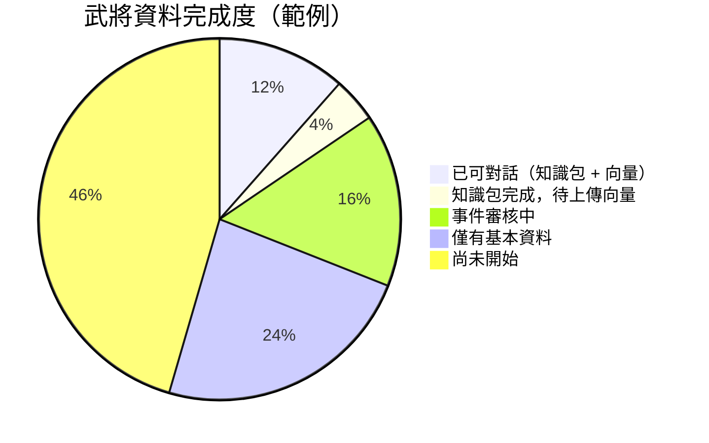

# 人物資料生產線簡報圖

**doc_id**: doc_server_service_0010  
**用途**: PM / 團隊簡報、跨部門溝通  
**技術細節版**: [三國人物資料推進流程](./三國人物資料推進流程.md)

---

## 簡化版管理圖（6 節點）

---

## 各節點說明

| 節點 | 負責人 | 主要產出 | 品質關卡 |
|---|---|---|---|
| 📚 原始文本 | 資料組 | 章節分段 / 原文片段 | 來源標記 |
| 🔍 人物識別 | 資料組 | 武將 ID / 基本屬性 | 去重 / 別名統一 |
| 📋 事件篩選 | 企劃審核 | 已審核事件清單 | 每事件需人工過審 |
| 📦 武將知識包 | 系統自動 | 可對話的完整武將資料 | 自動品質分 ≥ 0.6 |
| 🔎 向量索引 | 系統自動 | Pinecone 向量記錄 | 上傳確認 / 查詢測試 |
| 🎮 對話服務 | 工程 / QA | 玩家可對話的 NPC | 煙霧測試通過 |

---

## 生產進度追蹤建議

> 上圖數字為範例，實際數字由 `estimate_knowledge_completion.py` 產出。

---

## 各階段所需工時參考

| 階段 | 每位武將平均時間 | 可批次處理？ |
|---|---|---|
| 原始文本分段 | 10 分鐘 | ✅ 批次 |
| 人物識別整理 | 5 分鐘 | ✅ 批次 |
| 事件人工審核 | 30–60 分鐘 | ❌ 需逐一判斷 |
| 知識包建立 | 自動（&lt;1 分鐘） | ✅ 批次 |
| 向量上傳 | 自動（&lt;1 分鐘） | ✅ 批次 |
| 煙霧測試 | 15 分鐘 / 批次 | ✅ 批次 |

**瓶頸在「事件人工審核」**：這是唯一無法全自動的關卡，也是整條線的速率限制因子。

---

## 相關文件

- [三國人物資料推進流程](./三國人物資料推進流程.md)：技術細節版完整流程
- [武將基本資料從0到1的誕生](./武將基本資料從0到1的誕生.md)：單一武將詳細說明
- [NPC 行為決策流程](./NPC行為決策流程.md)：知識包產出後如何使用
