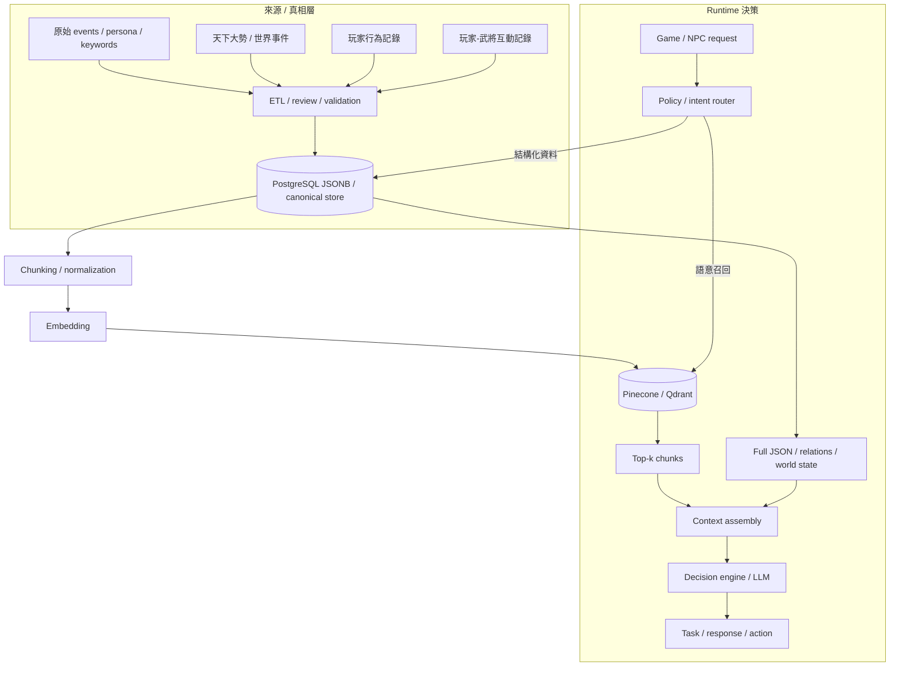

<!-- doc_id: doc_server_service_0004 -->
# 向量檢索與資料入庫

> 說明 Pinecone 先接、Qdrant 長期導入的策略，vector-ready records 匯出 / upsert / query 流程，以及 PostgreSQL + Vector DB 雙軌架構。

## 先看這三個結論

1. **真相不在向量庫**：vector DB 只負責召回，不是 canonical truth。
2. **人物最終決策至少要整合三類資料**：人物本體、天下大勢 / 世界事件、玩家行為 / 互動記錄。
3. **短期先 Pinecone、長期切 Qdrant**：但兩者都應共用同一套 vector record schema，避免 runtime 改寫。

## 角色分工

### 目前策略

- **Pinecone**：先快速接上、先打通雲端檢索鏈
- **Qdrant**：長期主向量庫候選
- **SQLite-vec**：本地快取 / 降級層

### 真相來源不在向量庫

向量庫只負責召回，真正的 source of truth 應放在：

- pipeline 產物
- canonical JSON / schema
- 後續 PostgreSQL / JSONB

## 必要資料來源

人物最終行為決策不能只看 persona，還必須把以下兩類資料納入：

1. **天下大勢 / 世界事件**
   - 全域大事
   - 區域大事
   - 玩家周圍剛發生的大事
2. **玩家行為與互動紀錄**
   - 玩家指令 / 選擇 / 資源變化 / 聲望
   - 玩家與某武將的對話、任務、衝突、好感與信任變化

## 何時讀向量資料？

通常只在「需要語意召回」時才讀：

- 任務規劃前，要找 persona、關係、近期事件或相似案例
- 要把世界事件與玩家記憶納入判斷
- 名稱 / 關係 / 事件有歧義時
- 上下文太長，不適合全塞進 prompt 時

不建議每輪對話都全量查向量庫。能從固定設定或 PostgreSQL 直接取到的資料，先不要查 vector。

## Runtime 決策流（雙軌資料流）

這一段就是 README 導航矩陣裡的「runtime 決策流」：也就是人物資料做好之後，如何再接上世界事件、玩家行為、互動記憶與向量召回，最後進入 decision engine / dialogue runtime。



## 環境設定

重要 env：

```text
NPC_VECTOR_PROVIDER_ORDER=pinecone,qdrant,sqlite_vec
NPC_VECTOR_DEFAULT_PROVIDER=pinecone
NPC_VECTOR_DIMENSION=1024
NPC_EMBEDDING_PROVIDER=sentence_transformers
NPC_EMBEDDING_MODEL=BAAI/bge-m3

PINECONE_API_KEY=<key>
NPC_PINECONE_INDEX=sanguo-npc-brain-dev

NPC_QDRANT_URL=http://127.0.0.1:6333
NPC_QDRANT_COLLECTION_FACTS=romance_facts_v1
NPC_QDRANT_COLLECTION_KEYWORDS=general_keywords_v1
NPC_QDRANT_COLLECTION_PERSONA=general_persona_v2
```

## Smoke 與健康檢查

### 檢查向量設定

```bash
cd server/npc-brain
python -m app.vector_env_smoke_test
```

### 啟動本地 Qdrant

```bash
cd server/npc-brain
docker compose -f docker-compose.qdrant.yml up -d
```

## 匯出 vector-ready records

在開始匯出或上傳其他資料前，建議先過一遍下面的 checklist：

- 先定義這批資料屬於哪個 namespace（facts / keywords / persona / world-events / player-memory / interaction-memory）
- 每筆資料都要有穩定 `id`，不要依賴執行批次產生隨機 key
- `text` 要是「真的拿來做召回的文字」，不是純 debug 欄位
- `metadata` 只放 primitive 值或 `list[string]`
- 長文本先切 chunk，並保留可回查 canonical store 的 `doc_id` / `event_id`

```bash
cd /mnt/c/Users/User/3KLife
python server/npc-brain/pipelines/sanguo-rag/export_vector_records.py \
  --events <ready-eval-events.jsonl> \
  --keyword-root <keyword-options-dir> \
  --persona-root <persona-cards-dir> \
  --general-id sima-yi \
  --output-root scratch/vector-ready-sima-yi \
  --overwrite
```

輸出包含：

- `vector-records.facts.jsonl`
- `vector-records.keywords.jsonl`
- `vector-records.persona.jsonl`
- `vector-records.all.jsonl`
- `vector-records.index.json`

## Pinecone 初始化與 upsert

### 初始化 index

```bash
cd /mnt/c/Users/User/3KLife
python server/npc-brain/pipelines/sanguo-rag/init_pinecone_index.py --dry-run
python server/npc-brain/pipelines/sanguo-rag/init_pinecone_index.py
```

### Upsert records

```bash
cd /mnt/c/Users/User/3KLife
python server/npc-brain/pipelines/sanguo-rag/upsert_pinecone_records.py \
  --records-root scratch/vector-ready-sima-yi \
  --embedding-provider mock
```

## `null` metadata 清洗規則

Pinecone metadata 不接受 `null`。目前 upsert 前會做遞迴清洗：

- 移除 `None / null`
- 保留 string / number / boolean
- list 只保留可接受的值

這個規則同時會套到：

- `VectorRecord.to_payload()`
- Pinecone upsert metadata
- Qdrant payload

因此像 `faction: null` 這類欄位，不會再直接送進 Pinecone 造成 400。

## 讀回測試

```bash
cd /mnt/c/Users/User/3KLife
python server/npc-brain/pipelines/sanguo-rag/query_pinecone_records.py \
  --namespace keywords \
  --query-text $'武將：sima-yi\n關鍵字分類：person\n關鍵字：司馬昭\n關聯人物：sima-yi、sima-zhao' \
  --embedding-provider mock \
  --top-k 3 \
  --expected-id 'keyword::sima-yi::sima-zhao'
```

## 何時該用 PostgreSQL + Vector DB？

當資料很大，而且同時需要：

- 嚴格版本與關聯管理
- JSON / JSONB 結構化查詢
- chunk-level 語意召回

就很適合雙軌：

- PostgreSQL / JSONB 管真相
- Pinecone / Qdrant 管召回

## 相關文件

- [README.md](../README.md)
- [武將基本資料從0到1的誕生](./武將基本資料從0到1的誕生.md)
- [對話服務與模型回退](./對話服務與模型回退.md)
- [三國人物資料推進流程](./三國人物資料推進流程.md)
- [LangGraph Studio 與部署](./LangGraph Studio 與部署.md)
